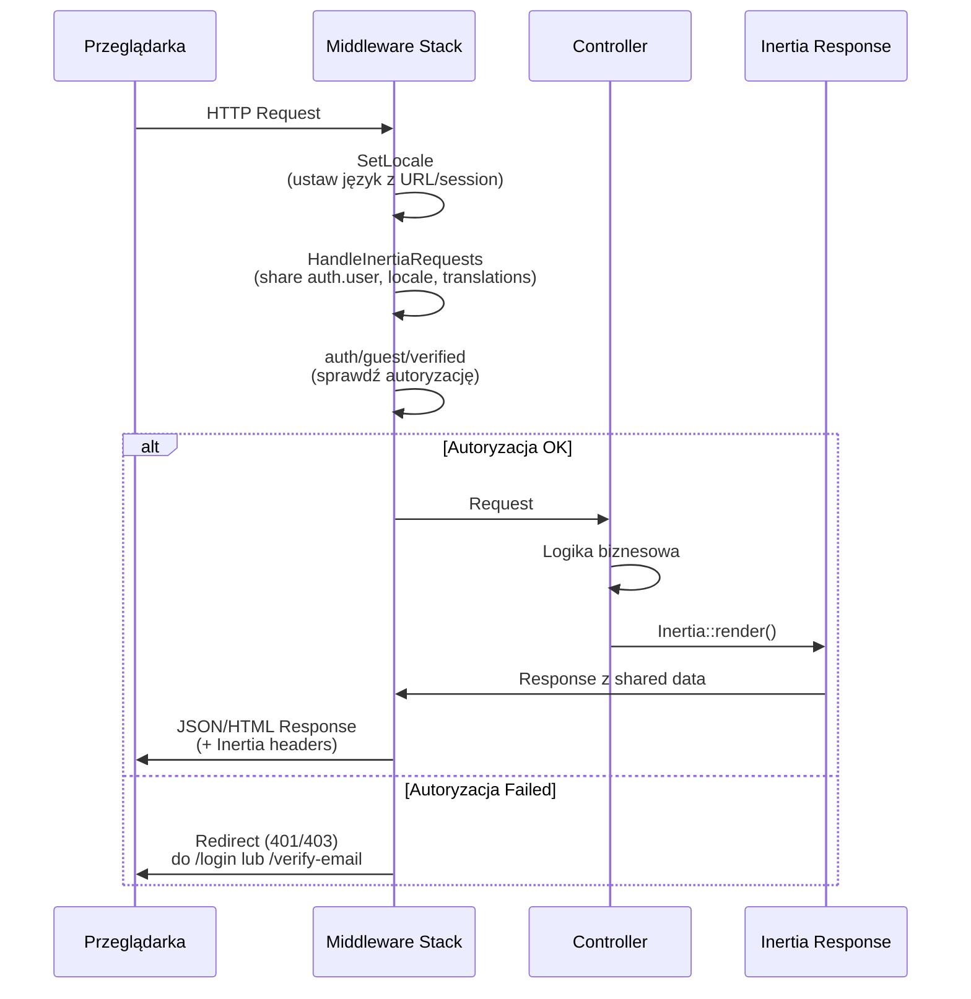
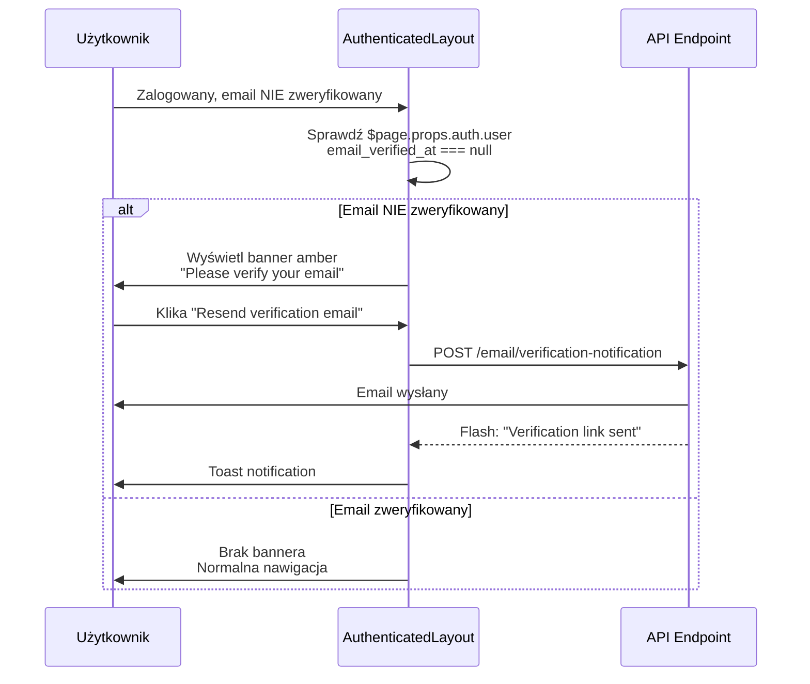

# Diagram Sekwencji - System Autentykacji

**Wersja:** 1.0
**Data:** 2025-11-06
**Projekt:** Just In Case

## Przegląd

Diagram sekwencji przedstawiający główne przepływy autentykacji w aplikacji Just In Case:
- Rejestracja nowego użytkownika
- Logowanie użytkownika
- Reset hasła
- Weryfikacja emaila
- Wylogowanie

## Diagram Sekwencji - Pełny Przepływ Autentykacji

```mermaid
sequenceDiagram
    actor User as Użytkownik
    participant Browser as Przeglądarka<br/>(Vue + Inertia)
    participant Laravel as Laravel<br/>Controllers
    participant Auth as Auth System<br/>(Session)
    participant DB as Baza Danych<br/>(User Model)
    participant Mail as Mail System<br/>(Email)

    %% REJESTRACJA
    Note over User,Mail: SCENARIUSZ 1: Rejestracja Nowego Użytkownika

    User->>Browser: Wypełnia formularz Register<br/>(nazwa, email, hasło)
    Browser->>Laravel: POST /register<br/>(FormData + CSRF)

    Laravel->>Laravel: Walidacja danych<br/>(email unikalny, hasło min 8)
    Laravel->>DB: Utwórz User<br/>(password: bcrypt)
    DB-->>Laravel: User created (id)

    Laravel->>Laravel: Event: Registered
    Laravel->>Mail: Wyślij email weryfikacyjny<br/>(signed URL, 24h)
    Mail-->>User: Email z linkiem aktywacyjnym

    Laravel->>Auth: Auto-login user<br/>(session + regenerate ID)
    Auth-->>Browser: Session cookie

    Laravel-->>Browser: Redirect /custodianships<br/>(Inertia response)
    Browser-->>User: Dashboard z bannerem<br/>"Verify your email"

    %% WERYFIKACJA EMAILA
    Note over User,Mail: SCENARIUSZ 2: Weryfikacja Emaila

    User->>Mail: Otwiera email<br/>Klika link weryfikacyjny
    Mail->>Browser: GET /verify-email/{id}/{hash}?signature=...
    Browser->>Laravel: Request z signed URL

    Laravel->>Laravel: Weryfikacja signature<br/>+ expiration (24h)
    Laravel->>Laravel: Sprawdź hash emaila
    Laravel->>DB: UPDATE email_verified_at = now()
    DB-->>Laravel: Updated

    Laravel->>Laravel: Event: Verified
    Laravel-->>Browser: Redirect /custodianships?verified=1
    Browser-->>User: Dashboard bez bannera<br/>Toast: "Email verified"

    %% PONOWNA WYSYŁKA EMAILA
    Note over User,Mail: SCENARIUSZ 2A: Ponowna Wysyłka Emaila Weryfikacyjnego

    User->>Browser: Klika "Resend verification email"<br/>w bannerze
    Browser->>Laravel: POST /email/verification-notification

    Laravel->>Laravel: Rate limiting (6/min)
    Laravel->>DB: Sprawdź czy już zweryfikowany
    DB-->>Laravel: email_verified_at = null

    Laravel->>Mail: Wyślij nowy email<br/>(nowy signed URL)
    Mail-->>User: Email z nowym linkiem

    Laravel-->>Browser: Flash: "Verification link sent"
    Browser-->>User: Toast notification

    %% LOGOWANIE
    Note over User,Mail: SCENARIUSZ 3: Logowanie Użytkownika

    User->>Browser: Wypełnia formularz Login<br/>(email, hasło, remember me)
    Browser->>Laravel: POST /login<br/>(LoginRequest)

    Laravel->>Laravel: Rate limiting (5/min)<br/>per email+IP
    Laravel->>DB: Znajdź User by email
    DB-->>Laravel: User data

    Laravel->>Laravel: Verify password<br/>(bcrypt compare)

    alt Credentials poprawne
        Laravel->>Auth: Login user<br/>(remember token jeśli checked)
        Auth->>Auth: Regenerate session ID<br/>(fixation protection)
        Auth-->>Browser: Session cookie<br/>(+ remember cookie jeśli checked)

        Laravel->>Laravel: Event: Login
        Laravel->>DB: UPDATE last_login_at = now()

        Laravel-->>Browser: Redirect /custodianships
        Browser-->>User: Dashboard
    else Credentials niepoprawne
        Laravel->>Laravel: Increment rate limit counter
        Laravel-->>Browser: Error: "Invalid credentials"
        Browser-->>User: Komunikat błędu
    end

    %% RESET HASŁA - CZĘŚĆ 1
    Note over User,Mail: SCENARIUSZ 4: Reset Hasła - Żądanie Linku

    User->>Browser: Klika "Forgot password?"<br/>w Login
    Browser->>Laravel: GET /forgot-password
    Laravel-->>Browser: ForgotPassword.vue

    User->>Browser: Wprowadza email
    Browser->>Laravel: POST /forgot-password<br/>(email)

    Laravel->>DB: Znajdź User by email

    alt Email istnieje
        DB-->>Laravel: User data
        Laravel->>Laravel: Generuj token (60 znaków)<br/>Hash: bcrypt
        Laravel->>DB: INSERT password_reset_tokens<br/>(email, hashed token, timestamp)
        Laravel->>Mail: Wyślij email z linkiem<br/>(plain token, 60min expiry)
        Mail-->>User: Email z linkiem reset
    else Email nie istnieje
        Laravel->>Laravel: Nie ujawniaj (security)
    end

    Laravel-->>Browser: "Password reset link sent"<br/>(zawsze sukces)
    Browser-->>User: Komunikat potwierdzenia

    %% RESET HASŁA - CZĘŚĆ 2
    Note over User,Mail: SCENARIUSZ 4A: Reset Hasła - Ustawienie Nowego

    User->>Mail: Otwiera email<br/>Klika link reset
    Mail->>Browser: GET /reset-password/{token}?email=...
    Browser->>Laravel: Request z tokenem
    Laravel-->>Browser: ResetPassword.vue<br/>(email pre-filled)

    User->>Browser: Wprowadza nowe hasło<br/>(+ potwierdzenie)
    Browser->>Laravel: POST /reset-password<br/>(token, email, password)

    Laravel->>DB: Znajdź token by email
    DB-->>Laravel: Token data (created_at)

    Laravel->>Laravel: Sprawdź expiration<br/>(60min od created_at)
    Laravel->>Laravel: Verify token hash<br/>(bcrypt compare)

    alt Token ważny
        Laravel->>DB: UPDATE User password<br/>(nowy bcrypt hash)
        Laravel->>DB: Regenerate remember_token<br/>(invalidate all sessions)
        Laravel->>DB: DELETE password_reset_tokens<br/>(one-time use)
        DB-->>Laravel: Updated

        Laravel->>Laravel: Event: PasswordReset
        Laravel-->>Browser: Redirect /login<br/>Flash: "Password reset successful"
        Browser-->>User: Login screen<br/>Toast notification
    else Token nieważny/wygasły
        Laravel-->>Browser: Error: "Invalid or expired token"
        Browser-->>User: Komunikat błędu
    end

    %% WYLOGOWANIE
    Note over User,Mail: SCENARIUSZ 5: Wylogowanie Użytkownika

    User->>Browser: Klika "Logout"<br/>w menu użytkownika
    Browser->>Laravel: POST /logout

    Laravel->>Auth: Logout user<br/>(invalidate session)
    Auth->>Auth: Regenerate CSRF token
    Auth-->>Browser: Clear session cookie

    Laravel-->>Browser: Redirect /login
    Browser-->>User: Login screen

    %% POTWIERDZENIE HASŁA
    Note over User,Mail: SCENARIUSZ 6: Potwierdzenie Hasła (Wrażliwe Operacje)

    User->>Browser: Próbuje wykonać<br/>wrażliwą akcję<br/>(np. aktywacja powiernictwa)
    Browser->>Laravel: Request wymagający<br/>password confirmation

    Laravel->>Laravel: Sprawdź session<br/>password_confirmed_at

    alt Confirmation nieważne (>3h)
        Laravel-->>Browser: Redirect /confirm-password
        Browser-->>User: Formularz potwierdzenia

        User->>Browser: Wprowadza hasło
        Browser->>Laravel: POST /confirm-password

        Laravel->>DB: Znajdź User
        Laravel->>Laravel: Verify password

        alt Hasło poprawne
            Laravel->>Auth: Set session<br/>password_confirmed_at = now()
            Laravel-->>Browser: Redirect back<br/>do oryginalnej akcji
            Browser->>Laravel: Ponów request
            Laravel->>Laravel: Execute action
            Laravel-->>Browser: Success response
            Browser-->>User: Akcja wykonana
        else Hasło niepoprawne
            Laravel-->>Browser: Error: "Invalid password"
            Browser-->>User: Komunikat błędu
        end
    else Confirmation ważne (<3h)
        Laravel->>Laravel: Execute action
        Laravel-->>Browser: Success response
        Browser-->>User: Akcja wykonana
    end
```

## Kluczowe Elementy Bezpieczeństwa

### 1. Rate Limiting
- **Login**: 5 prób/minutę per email+IP
- **Password Reset**: 6 prób/godzinę per IP
- **Email Verification Resend**: 6 prób/minutę

### 2. Session Security
- **Session Fixation Protection**: Regeneracja ID po logowaniu
- **Session Invalidation**: Wylogowanie usuwa sesję
- **CSRF Protection**: Token w każdym formularzu
- **Remember Token Regeneration**: Po resecie hasła

### 3. Password Security
- **Hashing**: Bcrypt automatyczny
- **Minimum Length**: 8 znaków
- **Reset Token**: One-time use, 60 minut expiration
- **Verification Link**: Signed URL, 24 godziny expiration

### 4. User Enumeration Protection
- Password reset zawsze zwraca sukces (nie ujawnia czy email istnieje)
- Login error generyczny ("Invalid credentials")

## Przepływ Danych Middleware

## Integracja z Główną Aplikacją

### Banner Weryfikacji w AuthenticatedLayout

### Middleware na Routes Powiernictw

- **GET/POST /custodianships** → Middleware: `auth` (logowanie wymagane, weryfikacja NIE)
- **POST /custodianships/{id}/activate** → Middleware: `auth`, `verified` (weryfikacja wymagana)
- **GET/POST /profile** → Middleware: `auth` (logowanie wymagane)

## Zgodność z Wymaganiami PRD

| Requirement | Status | Implementacja |
|------------|--------|---------------|
| REQ-001 | ✅ | Rejestracja email+hasło z walidacją |
| REQ-002 | ✅ | Weryfikacja email, link 24h, ponowne wysłanie |
| REQ-003 | ✅ | Logowanie przed aktywacją możliwe |
| REQ-004 | ✅ | Reset hasła z linkiem 1h |
| REQ-005 | ✅ | Drafty bez weryfikacji |
| US-001 | ✅ | Rejestracja < 1 minuta |
| US-002 | ✅ | Aktywacja z emaila |
| US-003 | ✅ | Ponowne wysłanie linku |
| US-004 | ✅ | Logowanie z remember me |
| US-005 | ✅ | Reset hasła flow |
| METRIC-001 | ✅ | Time to First Custodianship < 5min |

---

**Koniec dokumentu**
