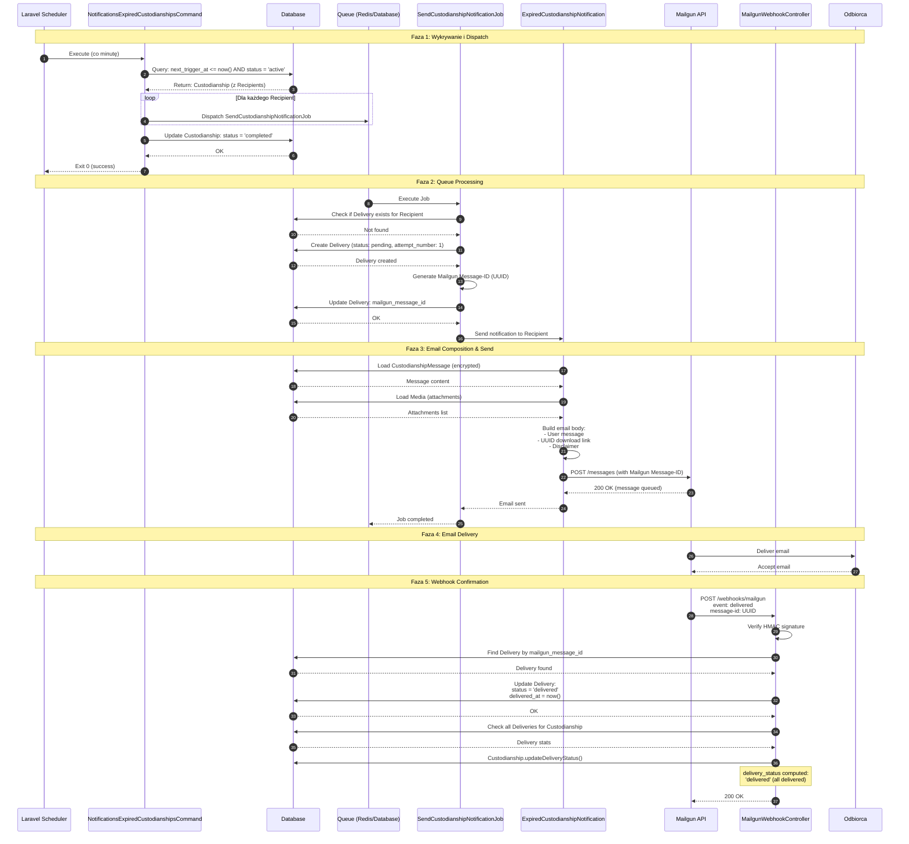
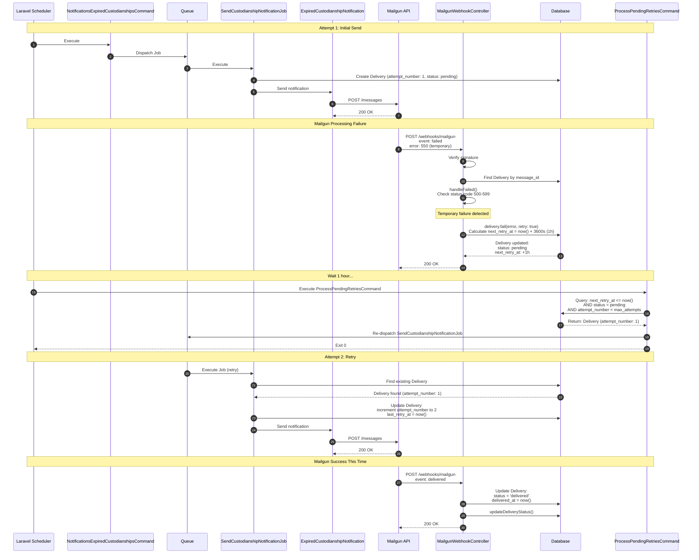
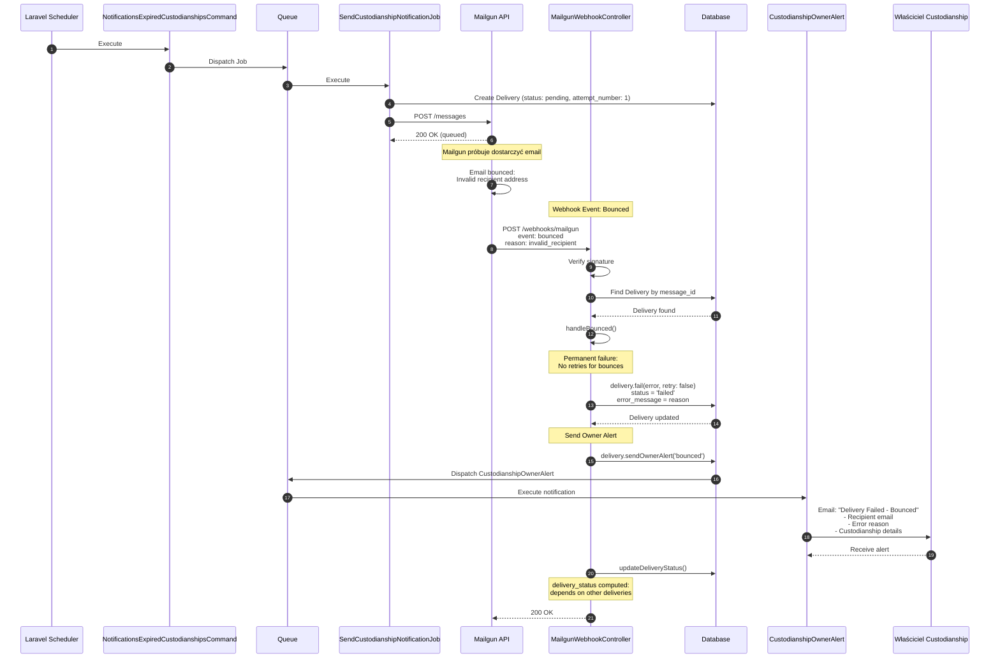
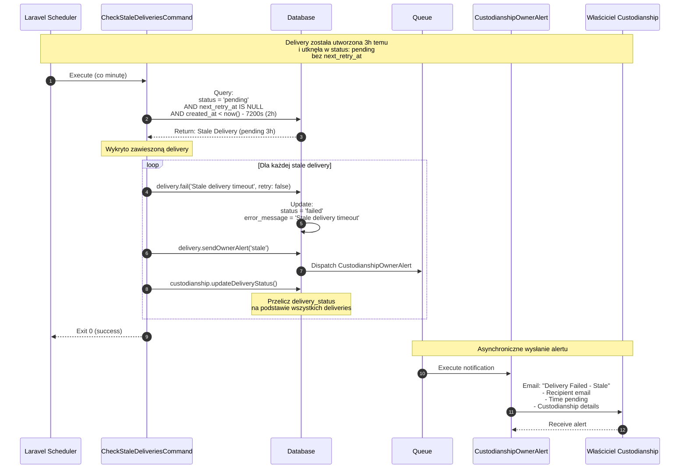
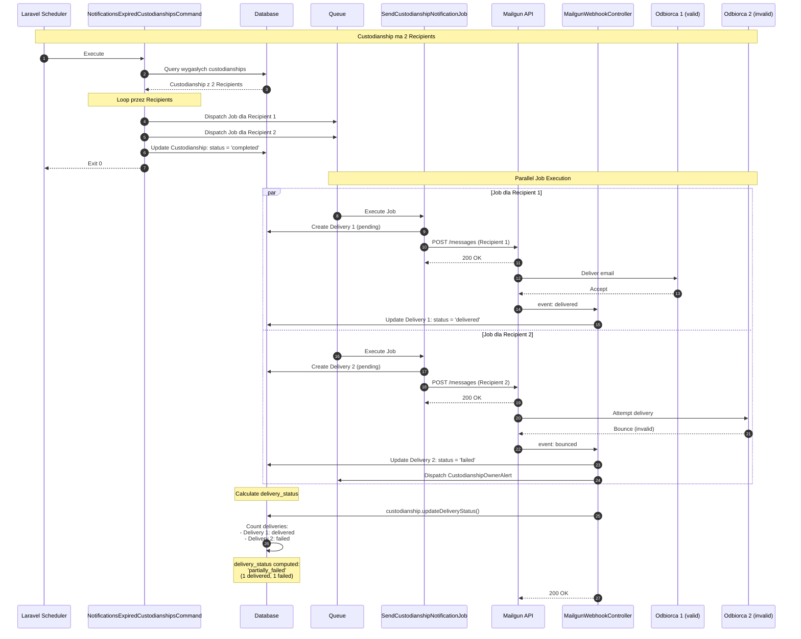
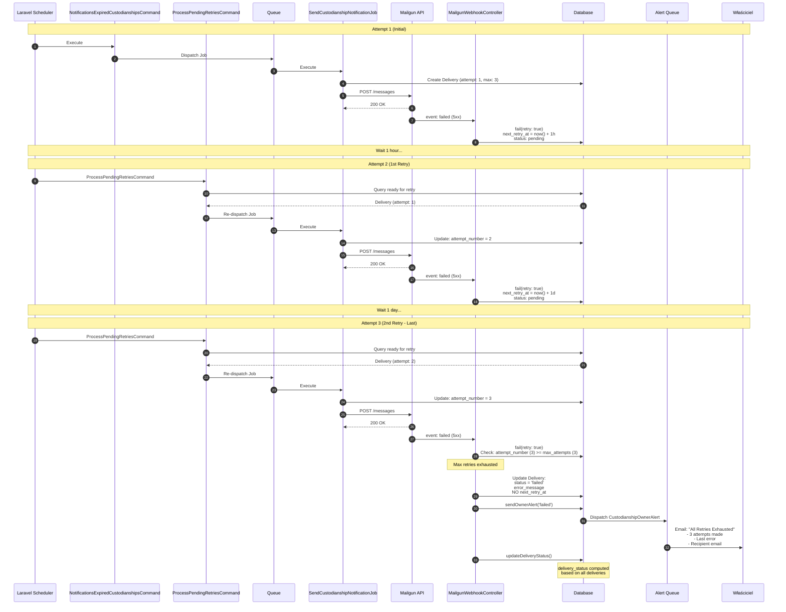

# Diagramy Sekwencji - Proces Dostarczania Wiadomości

Ten dokument przedstawia szczegółowe diagramy sekwencji pokazujące chronologiczny przepływ komunikacji między komponentami systemu delivery w aplikacji Just In Case.

## Scenariusz 1: Pomyślne Dostarczenie (Happy Path)

Ten diagram pokazuje standardowy przepływ od wykrycia wygasłego timera do pomyślnego dostarczenia emaila.

## Scenariusz 2: Temporary Failure z Retry Logic

Ten diagram pokazuje przepływ gdy email nie zostaje dostarczony z powodu błędu przejściowego (5xx) i następują retry z exponential backoff.

## Scenariusz 3: Hard Bounce (Permanent Failure)

Ten diagram pokazuje przepływ gdy email nie może być dostarczony z powodu nieprawidłowego adresu (hard bounce).

## Scenariusz 4: Stale Delivery Check

Ten diagram pokazuje przepływ wykrywania i oznaczania "zawisłych" delivery rekordów jako failed.

## Scenariusz 5: Multiple Recipients - Partial Failure

Ten diagram pokazuje custodianship z 2 odbiorcami, gdzie jeden jest dostarczony pomyślnie, a drugi fails.

## Scenariusz 6: Max Retries Exhausted

Ten diagram pokazuje pełny cykl retry aż do wyczerpania wszystkich 3 prób.

## Legenda dla Diagramów Sekwencji

### Uczestnicy (Participants)
- **Scheduler** - Laravel Task Scheduler (bootstrap/app.php)
- **Commands** - Artisan commands (NotificationsExpiredCustodianshipsCommand, ProcessPendingRetriesCommand, CheckStaleDeliveriesCommand)
- **Queue** - System kolejkowy (Redis/Database)
- **Job** - SendCustodianshipNotificationJob
- **Notif** - ExpiredCustodianshipNotification
- **AlertNotif** - CustodianshipOwnerAlert
- **Mailgun** - Mailgun API (mail provider)
- **Webhook** - MailgunWebhookController
- **DB** - Database (SQLite/MySQL)
- **Recipient** - Odbiorca wiadomości
- **Owner** - Właściciel custodianship

### Kluczowe Interakcje
1. **Synchroniczne** - Strzałki ciągłe (→)
2. **Asynchroniczne** - Strzałki przerywane (-->)
3. **Loop** - Pętla przez elementy (Recipients, Deliveries)
4. **Par** - Równoległe wykonanie (multiple recipients)
5. **Note** - Komentarze i opisy faz

### Retry Intervals
- **1st retry**: 3600s = 1 godzina
- **2nd retry**: 86400s = 1 dzień
- **3rd retry**: 604800s = 1 tydzień
- **Max attempts**: 3

### Stale Delivery Threshold
- **Timeout**: 7200s = 2 godziny
- **Condition**: status = pending AND next_retry_at IS NULL AND created_at < now() - 2h

## Pliki Źródłowe

### Commands
- `app/Console/Commands/NotificationsExpiredCustodianshipsCommand.php`
- `app/Console/Commands/ProcessPendingRetriesCommand.php`
- `app/Console/Commands/CheckStaleDeliveriesCommand.php`
- `app/Console/Commands/CleanupTemporaryAttachments.php`

### Jobs & Notifications
- `app/Jobs/SendCustodianshipNotificationJob.php`
- `app/Notifications/ExpiredCustodianshipNotification.php`
- `app/Notifications/CustodianshipOwnerAlert.php`

### Controllers
- `app/Http/Controllers/MailgunWebhookController.php`

### Models
- `app/Models/Custodianship.php`
- `app/Models/Delivery.php`
- `app/Models/Recipient.php`
- `app/Models/CustodianshipMessage.php`

### Configuration
- `config/custodianship.php` - Retry intervals, thresholds, attachment limits
- `bootstrap/app.php` - Scheduler configuration

### Routes
- `routes/web.php` - Webhook endpoint: `POST /webhooks/mailgun`
