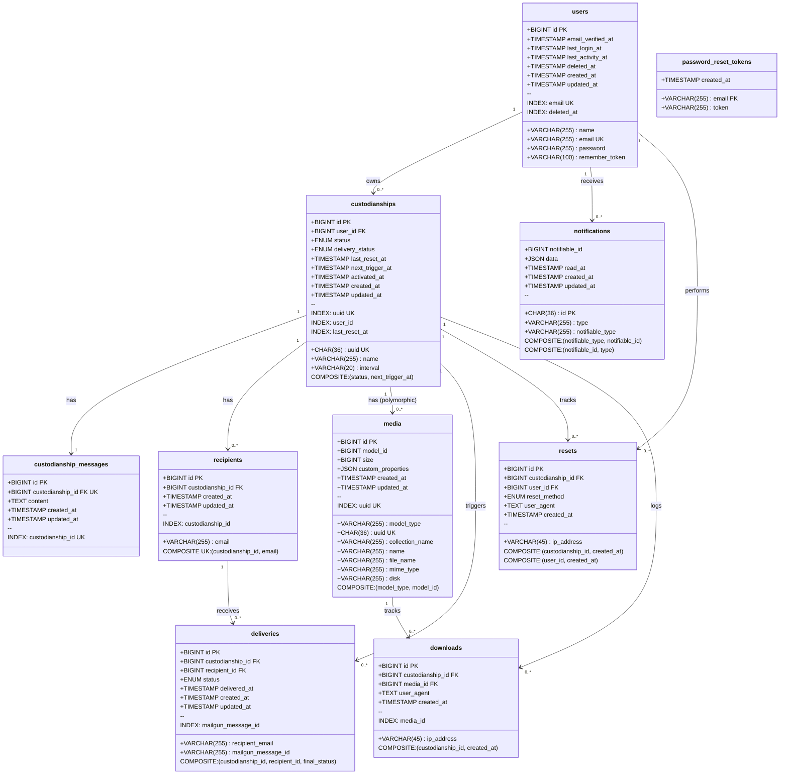

# Schemat Bazy Danych MySQL - Just In Case MVP

**Wersja:** 1.1
**Data:** 2025-10-29
**Status:** Zatwierdzona struktura bazy danych

---

## 1. Tabele

### 1.1 Tabela `users`

| Kolumna | Typ | Ograniczenia | Opis |
|---------|-----|--------------|------|
| `id` | BIGINT UNSIGNED | PK, AUTO_INCREMENT | Unikalny identyfikator użytkownika |
| `name` | VARCHAR(255) | NOT NULL | Imię i nazwisko użytkownika |
| `email` | VARCHAR(255) | NOT NULL, UNIQUE | Adres email (login) |
| `email_verified_at` | TIMESTAMP | NULL | Data weryfikacji adresu email |
| `password` | VARCHAR(255) | NOT NULL | Zaszyfrowane hasło |
| `remember_token` | VARCHAR(100) | NULL | Token "remember me" |
| `last_login_at` | TIMESTAMP | NULL | Timestamp ostatniego logowania |
| `last_activity_at` | TIMESTAMP | NULL | Timestamp ostatniej aktywności |
| `deleted_at` | TIMESTAMP | NULL | Soft delete dla RODO |
| `created_at` | TIMESTAMP | NOT NULL | Data utworzenia konta |
| `updated_at` | TIMESTAMP | NOT NULL | Data ostatniej aktualizacji |

**Indeksy:**
- PRIMARY KEY: `id`
- UNIQUE: `email`
- INDEX: `deleted_at`

---

### 1.2 Tabela `password_reset_tokens`

| Kolumna | Typ | Ograniczenia | Opis |
|---------|-----|--------------|------|
| `email` | VARCHAR(255) | PK | Email użytkownika |
| `token` | VARCHAR(255) | NOT NULL | Token resetowania hasła |
| `created_at` | TIMESTAMP | NOT NULL | Data utworzenia tokena |

**Indeksy:**
- PRIMARY KEY: `email`

---

### 1.3 Tabela `custodianships`

| Kolumna | Typ | Ograniczenia | Opis |
|---------|-----|--------------|------|
| `id` | BIGINT UNSIGNED | PK, AUTO_INCREMENT | Unikalny identyfikator powiernictwa |
| `uuid` | CHAR(36) | NOT NULL, UNIQUE | UUID v4 dla route model binding |
| `user_id` | BIGINT UNSIGNED | NOT NULL, FK → users(id) ON DELETE CASCADE | Właściciel powiernictwa |
| `name` | VARCHAR(255) | NOT NULL | Nazwa powiernictwa |
| `status` | ENUM('draft', 'active', 'completed') | NOT NULL, DEFAULT 'draft' | Status powiernictwa |
| `delivery_status` | ENUM('pending', 'sent', 'delivered', 'failed', 'bounced') | NULL | Status dostarczenia wiadomości |
| `interval` | VARCHAR(20) | NOT NULL | Interwał w formacie ISO 8601 |
| `last_reset_at` | TIMESTAMP | NULL | Timestamp ostatniego resetu timera |
| `next_trigger_at` | TIMESTAMP | NULL | Timestamp wygaśnięcia timera |
| `activated_at` | TIMESTAMP | NULL | Timestamp aktywacji |
| `created_at` | TIMESTAMP | NOT NULL | Data utworzenia |
| `updated_at` | TIMESTAMP | NOT NULL | Data ostatniej aktualizacji |

**Indeksy:**
- PRIMARY KEY: `id`
- UNIQUE: `uuid`
- INDEX: `user_id`
- INDEX: `last_reset_at`
- **COMPOSITE INDEX (KRYTYCZNY)**: `idx_active_triggers (status, next_trigger_at)`

**Foreign Keys:**
- `user_id` REFERENCES `users(id)` ON DELETE CASCADE

---

### 1.4 Tabela `custodianship_messages`

| Kolumna | Typ | Ograniczenia | Opis |
|---------|-----|--------------|------|
| `id` | BIGINT UNSIGNED | PK, AUTO_INCREMENT | Unikalny identyfikator |
| `custodianship_id` | BIGINT UNSIGNED | NOT NULL, UNIQUE, FK → custodianships(id) ON DELETE CASCADE | Powiernictwo (relacja 1:1) |
| `content` | TEXT | NOT NULL | Zaszyfrowana treść wiadomości |
| `created_at` | TIMESTAMP | NOT NULL | Data utworzenia |
| `updated_at` | TIMESTAMP | NOT NULL | Data ostatniej aktualizacji |

**Indeksy:**
- PRIMARY KEY: `id`
- UNIQUE: `custodianship_id`

**Foreign Keys:**
- `custodianship_id` REFERENCES `custodianships(id)` ON DELETE CASCADE

---

### 1.5 Tabela `recipients`

| Kolumna | Typ | Ograniczenia | Opis |
|---------|-----|--------------|------|
| `id` | BIGINT UNSIGNED | PK, AUTO_INCREMENT | Unikalny identyfikator |
| `custodianship_id` | BIGINT UNSIGNED | NOT NULL, FK → custodianships(id) ON DELETE CASCADE | Powiernictwo |
| `email` | VARCHAR(255) | NOT NULL | Email odbiorcy |
| `created_at` | TIMESTAMP | NOT NULL | Data dodania |
| `updated_at` | TIMESTAMP | NOT NULL | Data ostatniej aktualizacji |

**Indeksy:**
- PRIMARY KEY: `id`
- INDEX: `custodianship_id`
- **UNIQUE COMPOSITE**: `unique_recipient (custodianship_id, email)`

**Foreign Keys:**
- `custodianship_id` REFERENCES `custodianships(id)` ON DELETE CASCADE

---

### 1.6 Tabela `media`

Struktura Spatie laravel-medialibrary.

| Kolumna | Typ | Ograniczenia | Opis |
|---------|-----|--------------|------|
| `id` | BIGINT UNSIGNED | PK, AUTO_INCREMENT | Unikalny identyfikator |
| `model_type` | VARCHAR(255) | NOT NULL | Typ modelu (polymorphic) |
| `model_id` | BIGINT UNSIGNED | NOT NULL | ID modelu |
| `uuid` | CHAR(36) | NULL, UNIQUE | UUID pliku |
| `collection_name` | VARCHAR(255) | NOT NULL | Nazwa kolekcji |
| `name` | VARCHAR(255) | NOT NULL | Oryginalna nazwa pliku |
| `file_name` | VARCHAR(255) | NOT NULL | Nazwa pliku na dysku |
| `mime_type` | VARCHAR(255) | NULL | Typ MIME |
| `disk` | VARCHAR(255) | NOT NULL | Dysk storage |
| `conversions_disk` | VARCHAR(255) | NULL | Dysk dla konwersji |
| `size` | BIGINT UNSIGNED | NOT NULL | Rozmiar w bajtach |
| `manipulations` | JSON | NOT NULL | Manipulacje obrazu |
| `custom_properties` | JSON | NOT NULL | Custom properties |
| `generated_conversions` | JSON | NOT NULL | Wygenerowane konwersje |
| `responsive_images` | JSON | NOT NULL | Responsive images |
| `order_column` | INT UNSIGNED | NULL | Kolejność |
| `created_at` | TIMESTAMP | NOT NULL | Data uploadu |
| `updated_at` | TIMESTAMP | NOT NULL | Data aktualizacji |

**Indeksy:**
- PRIMARY KEY: `id`
- **COMPOSITE INDEX**: `(model_type, model_id)`
- UNIQUE: `uuid`

---

### 1.7 Tabela `deliveries`

| Kolumna | Typ | Ograniczenia | Opis |
|---------|-----|--------------|------|
| `id` | BIGINT UNSIGNED | PK, AUTO_INCREMENT | Unikalny identyfikator |
| `custodianship_id` | BIGINT UNSIGNED | NOT NULL, FK → custodianships(id) ON DELETE CASCADE | Powiernictwo |
| `recipient_id` | BIGINT UNSIGNED | NOT NULL, FK → recipients(id) ON DELETE CASCADE | Odbiorca |
| `recipient_email` | VARCHAR(255) | NOT NULL | Snapshot emaila odbiorcy |
| `mailgun_message_id` | VARCHAR(255) | NULL | Message ID z Mailgun |
| `status` | ENUM('pending', 'delivered', 'failed') | NOT NULL, DEFAULT 'pending' | Finalny status dostarczenia |
| `delivered_at` | TIMESTAMP | NULL | Timestamp dostarczenia |
| `created_at` | TIMESTAMP | NOT NULL | Timestamp pierwszej próby |
| `updated_at` | TIMESTAMP | NOT NULL | Timestamp ostatniej aktualizacji |

**Indeksy:**
- PRIMARY KEY: `id`
- INDEX: `mailgun_message_id`
- **COMPOSITE INDEX**: `(custodianship_id, recipient_id, status)`

**Foreign Keys:**
- `custodianship_id` REFERENCES `custodianships(id)` ON DELETE CASCADE
- `recipient_id` REFERENCES `recipients(id)` ON DELETE CASCADE

---

### 1.8 Tabela `resets`

| Kolumna | Typ | Ograniczenia | Opis |
|---------|-----|--------------|------|
| `id` | BIGINT UNSIGNED | PK, AUTO_INCREMENT | Unikalny identyfikator |
| `custodianship_id` | BIGINT UNSIGNED | NOT NULL, FK → custodianships(id) ON DELETE CASCADE | Powiernictwo |
| `user_id` | BIGINT UNSIGNED | NOT NULL, FK → users(id) ON DELETE CASCADE | Użytkownik |
| `reset_method` | ENUM('manual_button', 'post_edit_modal') | NOT NULL | Metoda resetu |
| `ip_address` | VARCHAR(45) | NOT NULL | Adres IP |
| `user_agent` | TEXT | NOT NULL | User agent |
| `created_at` | TIMESTAMP | NOT NULL | Timestamp resetu |

**Indeksy:**
- PRIMARY KEY: `id`
- **COMPOSITE INDEX**: `(custodianship_id, created_at)`
- **COMPOSITE INDEX**: `(user_id, created_at)`

**Foreign Keys:**
- `custodianship_id` REFERENCES `custodianships(id)` ON DELETE CASCADE
- `user_id` REFERENCES `users(id)` ON DELETE CASCADE

---

### 1.9 Tabela `downloads`

| Kolumna | Typ | Ograniczenia | Opis |
|---------|-----|--------------|------|
| `id` | BIGINT UNSIGNED | PK, AUTO_INCREMENT | Unikalny identyfikator |
| `custodianship_id` | BIGINT UNSIGNED | NOT NULL, FK → custodianships(id) ON DELETE CASCADE | Powiernictwo |
| `media_id` | BIGINT UNSIGNED | NOT NULL, FK → media(id) ON DELETE CASCADE | Załącznik |
| `ip_address` | VARCHAR(45) | NOT NULL | Adres IP |
| `user_agent` | TEXT | NOT NULL | User agent |
| `created_at` | TIMESTAMP | NOT NULL | Timestamp pobrania |

**Indeksy:**
- PRIMARY KEY: `id`
- INDEX: `media_id`
- **COMPOSITE INDEX**: `(custodianship_id, created_at)`

**Foreign Keys:**
- `custodianship_id` REFERENCES `custodianships(id)` ON DELETE CASCADE
- `media_id` REFERENCES `media(id)` ON DELETE CASCADE

---

### 1.10 Tabela `notifications`

Standardowa tabela Laravel notifications.

| Kolumna | Typ | Ograniczenia | Opis |
|---------|-----|--------------|------|
| `id` | CHAR(36) | PK | UUID powiadomienia |
| `type` | VARCHAR(255) | NOT NULL | Klasa powiadomienia |
| `notifiable_type` | VARCHAR(255) | NOT NULL | Typ notifiable |
| `notifiable_id` | BIGINT UNSIGNED | NOT NULL | ID notifiable |
| `data` | JSON | NOT NULL | Dane powiadomienia |
| `read_at` | TIMESTAMP | NULL | Timestamp przeczytania |
| `created_at` | TIMESTAMP | NOT NULL | Data utworzenia |
| `updated_at` | TIMESTAMP | NOT NULL | Data aktualizacji |

**Indeksy:**
- PRIMARY KEY: `id`
- **COMPOSITE INDEX**: `(notifiable_type, notifiable_id)`
- **COMPOSITE INDEX**: `(notifiable_id, type)`

---

## 2. Diagram relacji (ERD)



---

## 3. Uwagi implementacyjne

### 3.1 Szyfrowanie
- `custodianship_messages.message_content`: AES-256 (Laravel `encrypt()`)
- Załączniki na S3: server-side encryption (AWS KMS)

### 3.2 Kluczowe indeksy
- `custodianships`: index `(status, next_trigger_at)` - **KRYTYCZNY** dla cron job sprawdzającego timery co minutę
- `recipients`: unique constraint `(custodianship_id, email)` - zapobiega duplikatom
- `resets`, `downloads`: composite indexes dla audit queries

### 3.3 Cascade delete
Wszystkie foreign keys z `ON DELETE CASCADE` dla RODO compliance:
```
User → Custodianships → (Messages, Media, Recipients, Resets, Deliveries, Downloads)
```

### 3.4 Kolejność migracji

1. `users`
2. `password_reset_tokens`
3. `custodianships`
4. `custodianship_messages`
5. `recipients`
6. `media` (Spatie)
7. `deliveries`
8. `delivery_attempts`
9. `resets`
10. `downloads`
11. `notifications`

---

**Dokument zatwierdzony:** 2025-10-18
**Następny review:** Po implementacji migracji
