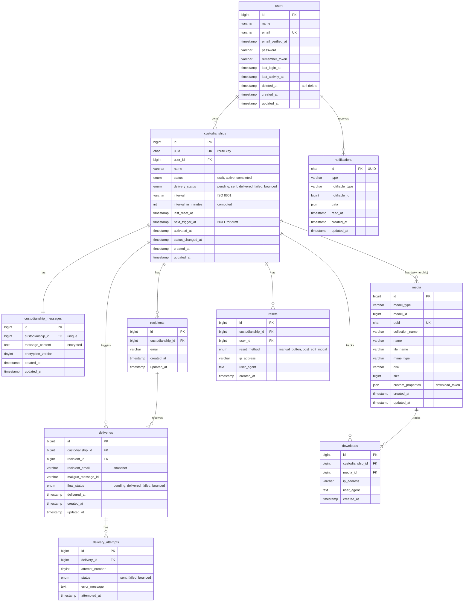

# Podsumowanie sesji planowania bazy danych - Just In Case MVP

## Decyzje podjęte przez użytkownika

1. **Treść wiadomości powiernictwa** - powinna być w oddzielnej tabeli `custodianship_messages` (nie w głównej tabeli `custodianships`)
2. **Relacja custodianships-recipients** - relacja 1:N realizowana przez bezpośrednią kolumnę FK w tabeli `recipients`
3. **Interwał czasowy** - użycie typu VARCHAR z formatem ISO 8601 (np. "P30D", "P90D")
4. **Indeksowanie timerów** - kolumny `last_reset_at` i `next_trigger_at` muszą być indeksowane
5. **Załączniki** - wykorzystanie pakietu `spatie/laravel-medialibrary`, tabela `attachments` nie jest potrzebna
6. **Retencja audit logów** - brak automatycznej retencji w MVP (ręczne zarządzanie post-MVP)
7. **Status delivery_failed** - osobna kolumna `delivery_status` zamiast statusu w głównym ENUM
8. **Relacja deliveries-recipients** - jeden rekord per recipient z FK do `recipients`
9. **Cascade delete dla resetów** - ON DELETE CASCADE przy usunięciu powiernictwa
10. **Progi kolorów timerów** - konfiguracja w pliku config (bez tabeli w bazie)
11. **Plan użytkownika** - brak kolumny `plan` w tabeli `users`, tabela `subscriptions` dopiero post-MVP
12. **Autentykacja** - Laravel Fortify (standardowa tabela `users` + `password_reset_tokens`)
13. **Unique constraint recipients** - UNIQUE KEY na (custodianship_id, email)
14. **Deliveries - struktura attemptów** - osobne rekordy dla każdej próby wysyłki w tej samej tabeli
15. **Activated_at** - dodanie kolumny dla analityki Draft to Active Conversion
16. **Snapshot email odbiorcy** - kolumna `recipient_email` w `deliveries` jako immutable snapshot
17. **Notifications** - wykorzystanie standardowej tabeli Laravel `notifications`
18. **Downloads logging** - tylko successful downloads (bez failed attempts)
19. **UUID generation** - Laravel observer zamiast database trigger
20. **Spatie media cascade** - automatyczna obsługa przez Spatie (bez manualnego ON DELETE CASCADE)
21. **Rate limiting resetów** - niepotrzebne w MVP
22. **Audit logs** - osobne tabele zamiast globalnej tabeli `audit_logs`
23. **Interval storage** - VARCHAR z ISO 8601 duration + kolumna pomocnicza `interval_in_minutes`
24. **Deliveries i attempts** - rozdzielenie na tabele `deliveries` + `delivery_attempts`
25. **Next_trigger_at nullable** - NULL dla status='draft', wartość po aktywacji
26. **Soft deletes custodianships** - NIE, tylko hard delete zgodnie z REQ-010
27. **Downloads throttling** - na poziomie middleware, bez logowania failed attempts

## Dopasowane rekomendacje

### Struktura tabel - Kluczowe encje

**1. Tabela `users`**

Kolumny:
- `id` - BIGINT UNSIGNED, primary key, auto_increment
- `name` - VARCHAR(255)
- `email` - VARCHAR(255), unique
- `email_verified_at` - TIMESTAMP, nullable
- `password` - VARCHAR(255)
- `remember_token` - VARCHAR(100), nullable
- `last_login_at` - TIMESTAMP, nullable
- `last_activity_at` - TIMESTAMP, nullable
- `deleted_at` - TIMESTAMP, nullable (soft deletes dla RODO)
- `created_at` - TIMESTAMP
- `updated_at` - TIMESTAMP

Uwagi:
- Brak kolumny `plan` - freemium sprawdzany przez istnienie rekordu w `subscriptions` (post-MVP)
- Laravel Fortify - standardowa tabela bez dodatkowych kolumn 2FA w MVP

---

**2. Tabela `password_reset_tokens`**

Kolumny:
- `email` - VARCHAR(255), primary key
- `token` - VARCHAR(255)
- `created_at` - TIMESTAMP

Uwagi:
- Laravel standard
- Wygasanie: 1h (konfiguracja w `config/auth.php`)

---

**3. Tabela `custodianships`**

Kolumny:
- `id` - BIGINT UNSIGNED, primary key, auto_increment
- `uuid` - CHAR(36), unique, indeksowany
- `user_id` - BIGINT UNSIGNED, foreign key → users(id), ON DELETE CASCADE
- `name` - VARCHAR(255)
- `status` - ENUM('draft', 'active', 'completed')
- `delivery_status` - ENUM('pending', 'sent', 'delivered', 'failed', 'bounced'), nullable
- `interval` - VARCHAR(20), format ISO 8601 (np. "P30D", "P90D")
- `interval_in_minutes` - INTEGER UNSIGNED, generated/computed column
- `last_reset_at` - TIMESTAMP, nullable, indeksowany
- `next_trigger_at` - TIMESTAMP, nullable, indeksowany
- `activated_at` - TIMESTAMP, nullable
- `status_changed_at` - TIMESTAMP, nullable
- `created_at` - TIMESTAMP
- `updated_at` - TIMESTAMP

Indeksy:
- **INDEX `idx_active_triggers` (status, next_trigger_at)** - KRYTYCZNY dla cron job co minutę
- INDEX na `uuid`
- INDEX na `user_id`
- INDEX na `last_reset_at`

Uwagi:
- **UUID**: generowany przez Laravel observer przy utworzeniu
- **Route model binding**: przez `uuid` zamiast `id`
- `next_trigger_at` NULL dla status='draft'

---

**4. Tabela `custodianship_messages`**

Kolumny:
- `id` - BIGINT UNSIGNED, primary key, auto_increment
- `custodianship_id` - BIGINT UNSIGNED, foreign key → custodianships(id), unique (relacja 1:1)
- `message_content` - TEXT, zaszyfrowany przez Laravel `encrypt()` (AES-256)
- `encryption_version` - TINYINT, default 1
- `created_at` - TIMESTAMP
- `updated_at` - TIMESTAMP

Uwagi:
- Subject i footer generowane dynamicznie przez system (REQ-028)
- Kolumna `encryption_version` dla potencjalnej rotacji kluczy

---

**5. Tabela `recipients`**

Kolumny:
- `id` - BIGINT UNSIGNED, primary key, auto_increment
- `custodianship_id` - BIGINT UNSIGNED, foreign key → custodianships(id), indeksowany
- `email` - VARCHAR(255)
- `created_at` - TIMESTAMP
- `updated_at` - TIMESTAMP

Constraints:
- **UNIQUE KEY `unique_recipient` (custodianship_id, email)**

Uwagi:
- Indeks złożony zapewnia unikalność odbiorcy w ramach powiernictwa
- Jeden odbiorca może być w wielu różnych powiernictwach

---

**6. Tabela `media` (Spatie laravel-medialibrary)**

Kolumny (automatyczna struktura z pakietu):
- `id` - BIGINT UNSIGNED, primary key, auto_increment
- `model_type` - VARCHAR(255)
- `model_id` - BIGINT UNSIGNED
- `uuid` - CHAR(36), unique, nullable
- `collection_name` - VARCHAR(255)
- `name` - VARCHAR(255)
- `file_name` - VARCHAR(255)
- `mime_type` - VARCHAR(255), nullable
- `disk` - VARCHAR(255)
- `conversions_disk` - VARCHAR(255), nullable
- `size` - BIGINT UNSIGNED
- `manipulations` - JSON
- `custom_properties` - JSON
- `generated_conversions` - JSON
- `responsive_images` - JSON
- `order_column` - INTEGER UNSIGNED, nullable
- `created_at` - TIMESTAMP
- `updated_at` - TIMESTAMP

Indeksy:
- INDEX na `(model_type, model_id)`
- INDEX na `uuid`

Uwagi:
- **Custom property**: `download_token` (64 chars random string) dla bezpiecznych linków
- Collection name dla załączników: `'attachments'`
- Endpoint: `/custodianships/{custodianship:uuid}/attachments/{token}`
- **Cascade delete**: automatyczny przez Spatie events (HasMedia trait)

---

**7. Tabela `deliveries`**

Kolumny:
- `id` - BIGINT UNSIGNED, primary key, auto_increment
- `custodianship_id` - BIGINT UNSIGNED, foreign key → custodianships(id)
- `recipient_id` - BIGINT UNSIGNED, foreign key → recipients(id), ON DELETE CASCADE
- `recipient_email` - VARCHAR(255), snapshot (immutable)
- `mailgun_message_id` - VARCHAR(255), nullable
- `final_status` - ENUM('pending', 'delivered', 'failed', 'bounced')
- `delivered_at` - TIMESTAMP, nullable
- `created_at` - TIMESTAMP
- `updated_at` - TIMESTAMP

Indeksy:
- INDEX na `(custodianship_id, recipient_id, final_status)` dla retry logic

Uwagi:
- **Jeden rekord per recipient**
- `recipient_email` jako immutable snapshot z momentu wysyłki
- Snapshot zachowany nawet gdy recipient.email zostanie zmieniony

---

**8. Tabela `delivery_attempts`**

Kolumny:
- `id` - BIGINT UNSIGNED, primary key, auto_increment
- `delivery_id` - BIGINT UNSIGNED, foreign key → deliveries(id)
- `attempt_number` - TINYINT
- `status` - ENUM('sent', 'failed', 'bounced')
- `error_message` - TEXT, nullable
- `attempted_at` - TIMESTAMP

Indeksy:
- INDEX na `(delivery_id, attempt_number)`

Uwagi:
- **Rozdzielenie attemptów** od głównej tabeli deliveries dla czystości query
- Maksymalnie 3 próby z exponential backoff (REQ-030)

---

**9. Tabela `resets`**

Kolumny:
- `id` - BIGINT UNSIGNED, primary key, auto_increment
- `custodianship_id` - BIGINT UNSIGNED, foreign key → custodianships(id), ON DELETE CASCADE
- `user_id` - BIGINT UNSIGNED, foreign key → users(id), ON DELETE CASCADE
- `reset_method` - ENUM('manual_button', 'post_edit_modal')
- `ip_address` - VARCHAR(45), obsługa IPv6
- `user_agent` - TEXT
- `created_at` - TIMESTAMP, indeksowany

Indeksy:
- INDEX na `(custodianship_id, created_at)`
- INDEX na `(user_id, created_at)`

Uwagi:
- **Brak retencji w MVP** - ręczne zarządzanie post-MVP
- **Brak indeksu na ip_address** - rate limiting resetów nie jest w MVP
- Audit log dla wszystkich resetów timerów

---

**10. Tabela `downloads`**

Kolumny:
- `id` - BIGINT UNSIGNED, primary key, auto_increment
- `custodianship_id` - BIGINT UNSIGNED, foreign key → custodianships(id)
- `media_id` - BIGINT UNSIGNED, foreign key → media(id)
- `ip_address` - VARCHAR(45)
- `user_agent` - TEXT
- `created_at` - TIMESTAMP

Indeksy:
- INDEX na `(custodianship_id, created_at)` dla raportów

Uwagi:
- **Tylko successful downloads** - brak logowania failed attempts
- Throttling na poziomie middleware (bez logowania w bazie)
- REQ-019: logowanie każdego pobrania załącznika

---

**11. Tabela `notifications` (Laravel built-in)**

Kolumny:
- `id` - CHAR(36), primary key, UUID
- `type` - VARCHAR(255)
- `notifiable_type` - VARCHAR(255)
- `notifiable_id` - BIGINT UNSIGNED
- `data` - JSON
- `read_at` - TIMESTAMP, nullable
- `created_at` - TIMESTAMP
- `updated_at` - TIMESTAMP

Indeksy:
- INDEX na `(notifiable_type, notifiable_id)`
- INDEX na `(notifiable_id, type)` dla zapobiegania duplikatom

Uwagi:
- Standardowa struktura Laravel notifications
- Dla REQ-037 (przypomnienie 7 dni przed wygaśnięciem)
- `data` JSON zawiera: `{"custodianship_id": 123, "days_remaining": 7, "type": "expiry_reminder"}`
- Query zapobiegający duplikatom: `WHERE notifiable_id = user_id AND type = 'App\\Notifications\\ExpiryReminder' AND JSON_EXTRACT(data, '$.custodianship_id') = ?`

### Bezpieczeństwo i szyfrowanie

**Szyfrowanie danych**
- `custodianship_messages.message_content`: AES-256 przez Laravel `encrypt()`
- Kolumna `encryption_version` dla potencjalnej rotacji kluczy
- S3 server-side encryption (AWS KMS) dla załączników
- APP_KEY jako master encryption key (zarządzany przez AWS Secrets Manager)

**Tokeny i UUID**
- `custodianships.uuid`: CHAR(36), UUID v4, non-enumerable URLs
- `media.custom_properties.download_token`: 64 chars random string
- `password_reset_tokens.token`: Laravel standard (SHA-256 hashed)

**Authorization**
- Laravel Policies: tylko `user_id == custodianship.user_id` może edytować
- Brak RLS na poziomie bazy - autoryzacja na poziomie aplikacji

### Skalowalność i wydajność

**Indeksy krytyczne**
1. `custodianships`: `INDEX idx_active_triggers (status, next_trigger_at)` - **absolutnie krytyczny dla cron job co minutę**
2. `custodianships`: indeks na `uuid` (route model binding)
3. `custodianships`: indeks na `user_id` (dashboard query)
4. `recipients`: indeks złożony `(custodianship_id, email)` (unique constraint)
5. `resets`: indeks na `created_at` (audit queries)
6. `deliveries`: indeks na `(custodianship_id, recipient_id, final_status)` (retry logic)
7. `notifications`: indeks na `(notifiable_id, type)` (zapobieganie duplikatom)

**Partial index (MySQL 8.0)**
- `INDEX (status, next_trigger_at) WHERE next_trigger_at IS NOT NULL` - optymalizacja dla NULL values w draft status

**Query optimization**
- Eager loading dla N+1 prevention: `$user->custodianships()->with(['recipients', 'media'])->get()`
- Connection pooling dla MySQL (limit ~150 concurrent connections)
- Migracja do AWS RDS + read replicas przy 5000+ użytkowników

### Integracja z pakietami Laravel

**Spatie laravel-medialibrary**
- Model `Custodianship` implements `HasMedia` trait
- Kolekcja: `'attachments'`
- Custom properties: `download_token` (64 chars)
- Automatyczne usuwanie media przy usunięciu modelu
- S3 jako storage driver (konfiguracja w `config/filesystems.php`)

**Laravel Fortify**
- Standardowa tabela `users`
- Tabela `password_reset_tokens`
- Brak tabel 2FA w MVP (OUT-004)

**Laravel Notifications**
- Standardowa tabela `notifications`
- Kanały: email (Mailgun)
- Queued notifications dla async delivery

### Validacja i constraints

**Database constraints**
- `UNIQUE KEY unique_recipient (custodianship_id, email)` w `recipients`
- `custodianships.uuid` UNIQUE
- `users.email` UNIQUE
- FK z ON DELETE CASCADE dla RODO compliance

**Application-level validation**
- Limity freemium (3 custodianships, 2 recipients, 10MB) - Form Request validation
- ISO 8601 duration format - regex: `/^P(\d+D|T\d+H|T\d+M)$/`
- Email format validation dla `recipients.email`

### RODO Compliance

**Soft deletes**
- `users.deleted_at` dla 12-miesięcznej retencji nieaktywnych kont
- Scheduled job: identyfikacja kont gdzie `last_activity_at < NOW() - 12 months`
- Hard delete po dodatkowych 30 dniach od soft delete

**Cascade delete chain**
- User → Custodianships → (Messages, Media, Recipients, Resets, Deliveries, Downloads)
- REQ-010: explicit hard delete z confirmation dla custodianships

**Data export**
- Post-MVP: endpoint do eksportu wszystkich danych użytkownika (JSON)

## Schemat relacji

## Rozwiązane kwestie implementacyjne

1. **Interval storage - dokładna implementacja** ✅
   - VARCHAR z ISO 8601 string ("P30D") w bazie danych
   - `interval_in_minutes` obliczane w aplikacji Laravel (observer/accessor)
   - Brak generated column w bazie - pełna kontrola w aplikacji

2. **UUID generation timing dla download links** ✅
   - `custodianships.uuid` generowany przy utworzeniu rekordu (Laravel observer `creating()`)
   - **WAŻNE**: Dostęp do załączników tylko gdy `custodianships.status = 'completed'`
   - Middleware/kontroler musi weryfikować status przed udostępnieniem plików

3. **Media download token generation timing** ✅
   - `media.custom_properties.download_token` generowany przy upload
   - Pozwala na preview i testowanie linków przed wygaśnięciem timera

4. **Deliveries - initial status** ✅
   - Rekord w `deliveries` tworzony dopiero przy fizycznym wysłaniu wiadomości
   - Brak rekordów "pending" przed wysyłką
   - Status początkowy ustawiany przez job wysyłający email

5. **Activated_at - automatyczna aktualizacja** ✅
   - `custodianships.activated_at` ustawiane automatycznie przez observer
   - Observer nasłuchuje zmiany `status` z 'draft' na 'active'
   - Zapewnia spójność danych

6. **Status_changed_at tracking** ✅
   - **Kolumna `status_changed_at` NIE POWINNA ISTNIEĆ**
   - Brak trackingu zmian statusu w osobnej kolumnie
   - Jeśli potrzebne, można użyć `updated_at` lub audit log

7. **Mailgun webhook verification** ✅
   - Brak osobnej tabeli dla webhook events w MVP
   - Webhooks aktualizują bezpośrednio `deliveries` i `delivery_attempts`
   - Signature verification w kontrolerze webhook

8. **Encryption version handling** ✅
   - **Kolumna `encryption_version` NIE POWINNA ISTNIEĆ w MVP**
   - Brak funkcjonalności rotacji kluczy w MVP
   - Jeśli potrzebne post-MVP, kolumna zostanie dodana w migracji

9. **Notifications cleanup** ✅
   - Scheduled job usuwający notifications starsze niż 90 dni
   - Niski priorytet MVP - można zaimplementować później
   - Command: `php artisan notifications:cleanup`

10. **Downloads - aggregate reporting** ✅
    - Brak materialized view lub aggregate tables
    - Bezpośrednie query na `downloads` wystarczające dla MVP
    - Post-MVP: rozważyć caching lub aggregate tables przy większej skali

## Następne kroki

1. **Utworzenie migracji Laravel** dla wszystkich tabel w odpowiedniej kolejności (foreign keys)
2. **Konfiguracja Spatie media library** - custom properties, S3 driver, conversions
3. **Implementacja observers** - UUID generation, encryption, cascade logic
4. **Policies i Gates** - authorization rules
5. **Form Requests** - validation rules dla freemium limits
6. **Seeders i Factories** - dane testowe dla development
7. **Feature tests** - pokrycie kluczowych scenariuszy (cron job, cascade delete, retry logic)