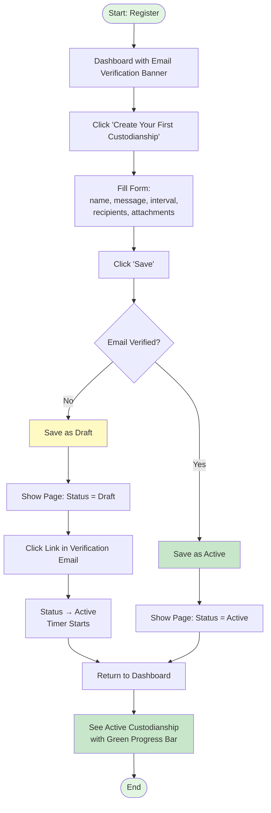
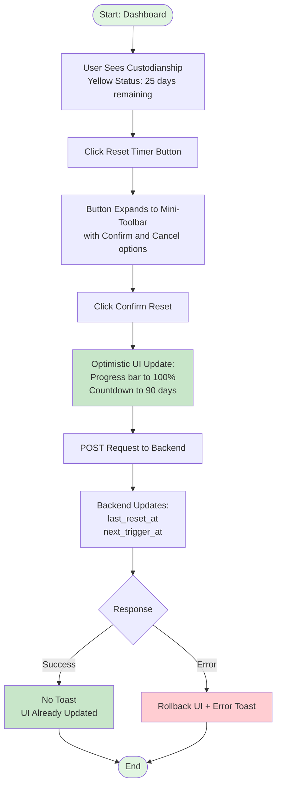
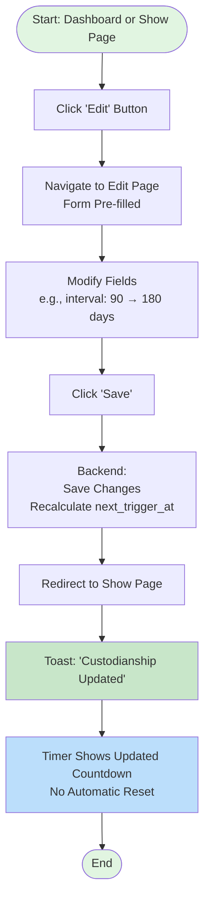
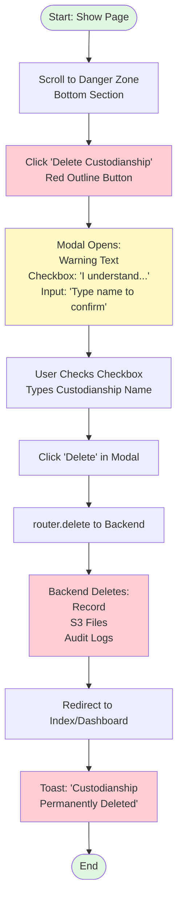
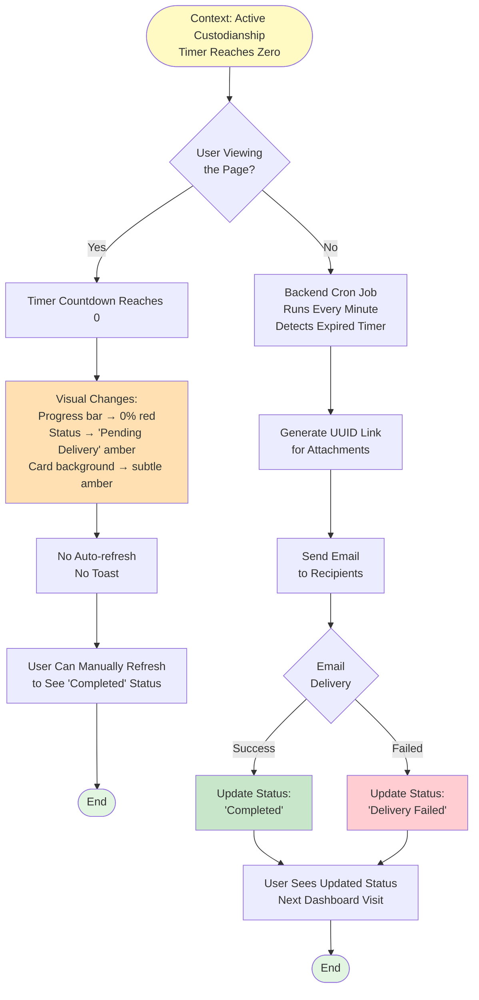

# Architektura UI dla Just In Case MVP

**Wersja:** 1.0
**Data:** 2025-10-21
**Status:** Zatwierdzona

---

## 1. Przegląd struktury UI

Just In Case to aplikacja MPA (Multi-Page Application) zbudowana na Vue 3 + Inertia.js, zintegrowana z backendem Laravel 12. Każda strona to osobny widok renderowany po stronie serwera, z płynną nawigacją między stronami dzięki Inertia.js (bez pełnego page reload). Architektura UI została zaprojektowana z naciskiem na prostotę, szybkość onboardingu (<5 minut do pierwszego aktywnego powiernictwa) oraz intuicyjność obsługi.

### Kluczowe założenia projektowe:

- **Osobne podstrony** zamiast modali (index, show, edit/create) - modali używamy tylko do potwierdzenia akcji
- **Responsywność** - mobile-first approach z Tailwind CSS 4
- **Dynamiczne timery** - countdown aktualizowany co sekundę z użyciem Page Visibility API
- **Walidacja server-side** - brak bibliotek walidacyjnych po stronie klienta
- **Optimistic UI** - natychmiastowa aktualizacja interfejsu przed otrzymaniem odpowiedzi z serwera (np. reset timera)
- **Dostępność** - komponenty Shadcn-vue z wbudowanym WCAG 2.1 compliance
- **MVP w języku angielskim** - lokalizacja polska planowana post-MVP

---

## 2. Lista widoków

### 2.1 Widoki autentykacji (Laravel Breeze)

#### 2.1.1 Register - `/register`

**Główny cel:** Rejestracja nowego użytkownika

**Kluczowe informacje:**
- Pola formularza: email, password, password confirmation
- Link do strony logowania dla istniejących użytkowników
- Checkbox akceptacji regulaminu (Terms of Service)

**Kluczowe komponenty:**
- `TextInput` (email, password)
- `Checkbox` (terms acceptance)
- `Button` (Submit)

**Względy UX/dostępności/bezpieczeństwa:**
- Walidacja email (format i unikalność) po stronie serwera
- Wymagania dla hasła: minimum 8 znaków
- CSRF protection (automatyczne przez Laravel)
- Wyraźny komunikat po rejestracji: "Check your email to verify your account"
- Redirect po sukcesie: Dashboard z bannerem weryfikacji email

---

#### 2.1.2 Login - `/login`

**Główny cel:** Autentykacja istniejących użytkowników

**Kluczowe informacje:**
- Pola: email, password
- Checkbox "Remember me"
- Linki: "Forgot password?", "Don't have an account? Register"

**Kluczowe komponenty:**
- `TextInput` (email, password)
- `Checkbox` (remember me)
- `Button` (Submit)

**Względy UX/dostępności/bezpieczeństwa:**
- Prosty, minimalistyczny design
- Błędne dane logowania: generyczny komunikat "Invalid email or password" (security best practice)
- Możliwość logowania przed aktywacją email (z ograniczeniami funkcjonalności)

---

#### 2.1.3 Forgot Password - `/forgot-password`

**Główny cel:** Inicjacja procesu resetowania hasła

**Kluczowe informacje:**
- Pole email
- Komunikat sukcesu: "Password reset link sent to your email"

**Kluczowe komponenty:**
- `TextInput` (email)
- `Button` (Send reset link)

**Względy UX/dostępności/bezpieczeństwa:**
- Zawsze wyświetla komunikat sukcesu (nawet jeśli email nie istnieje) - zapobiega enumeracji użytkowników
- Link resetujący ważny przez 1 godzinę (konfiguracja Laravel)

---

#### 2.1.4 Reset Password - `/reset-password/{token}`

**Główny cel:** Ustawienie nowego hasła przez link z emaila

**Kluczowe informacje:**
- Pola: new password, password confirmation
- Token walidowany przez backend

**Kluczowe komponenty:**
- `TextInput` (password)
- `Button` (Submit)

**Względy UX/dostępności/bezpieczeństwa:**
- Walidacja: minimum 8 znaków
- Wygasły token: komunikat z możliwością ponownego żądania resetu
- Po sukcesie: redirect do Login z komunikatem "Password changed successfully"

---

#### 2.1.5 Verify Email - Banner / `/verify-email`

**Główny cel:** Przypomnienie o konieczności weryfikacji email

**Kluczowe informacje:**
- Banner na górze Dashboard: "Please verify your email to activate custodianships"
- Przycisk "Resend verification email"

**Kluczowe komponenty:**
- `Alert` banner (Shadcn Alert)
- `Button` (Resend)

**Względy UX/dostępności/bezpieczeństwa:**
- Nieintrusywny ale widoczny (żółty/amber kolor)
- Automatycznie znika po weryfikacji
- Link weryfikacyjny ważny przez 24 godziny

---

### 2.2 Widoki głównej aplikacji

#### 2.2.1 Dashboard / Custodianships Index - `/custodianships`

**Główny cel:** Wyświetlenie listy wszystkich powiernictw użytkownika z możliwością szybkich akcji

**Kluczowe informacje do wyświetlenia:**
- Nagłówek: "My Custodianships"
- Przycisk "Create New Custodianship" (wyróżniony, primary button)
- Lista powiernictw (max 3 w planie free), dla każdego:
  - Nazwa powiernictwa (h3)
  - Status badge (draft, active, completed, delivery_failed)
  - Timer progress bar z tekstem "X days remaining of Y"
  - Kolor progress bar:
    - Zielony: > 30 dni pozostało
    - Żółty: 7-30 dni pozostało
    - Czerwony: < 7 dni pozostało lub expired
  - Lista odbiorców (email, max 2 widoczne)
  - Przyciski akcji:
    - **Reset Timer** (primary, zielony) - z inline confirmation
    - **View** (secondary, gray outline)
    - **Edit** (secondary, gray outline)

**Kluczowe komponenty widoku:**
- `CustodianshipCard` - karta dla każdego powiernictwa
- `TimerProgressBar` - wizualizacja pozostałego czasu
- `StatusBadge` - kolorowy badge ze statusem
- `ConfirmableButton` - przycisk Reset z inline potwierdzeniem
- `EmptyState` - gdy brak powiernictw (nowi użytkownicy)

**Względy UX/dostępności/bezpieczeństwa:**
- **Layout:** Stack (jedna kolumna) dla prostoty i responsywności
- **Sortowanie:** Najbliższe wygaśnięcie na górze
- **Empty state:** Pomocny komunikat z CTA dla nowych użytkowników (US-024):
  - Ikona (slot)
  - Tekst: "No custodianships yet. Create your first one to secure important information."
  - Przycisk: "Create Your First Custodianship"
- **Limity freemium:** Jeśli użytkownik ma 3 powiernictwa, przycisk "Create New" wyświetla modal z komunikatem o limicie
- **Email verification banner:** Jeśli email niezweryfikowany, wyświetl banner na górze
- **Accessibility:** Semantic HTML, ARIA labels dla progress bars, keyboard navigation

---

#### 2.2.2 Custodianship Create - `/custodianships/create`

**Główny cel:** Utworzenie nowego powiernictwa

**Kluczowe informacje:**
- Formularz z polami:
  1. **Name** (required, max 255 chars)
     - Label: "Custodianship Name"
     - Placeholder: "e.g., Bank account passwords, Crypto wallet access"
  2. **Message Content** (optional, rich text)
     - Label: "Message Content"
     - Rich text editor (Tiptap) z ograniczonymi opcjami: Bold, Italic, Bulleted List, Numbered List, Link
     - Placeholder: "Write the message you want to send..."
     - Output: Markdown
  3. **Interval** (required, dropdown select)
     - Label: "Time Interval"
     - Options: "1 month (30 days)", "2 months (60 days)", "3 months (90 days)", "6 months (180 days)", "1 year (365 days)"
  4. **Recipients** (required, 1-2 emails)
     - Label: "Recipients"
     - Dynamiczne wiersze: każdy z `<input type="email">` + przycisk X (delete)
     - Przycisk "+ Add recipient" (disabled gdy 2/2)
     - Komunikat limitu: "Max 2 recipients in free plan" (tooltip na disabled button)
  5. **Attachments** (optional, max 10MB total)
     - Label: "Attachments"
     - Drag & drop zone + file input browse
     - Auto-upload do temp storage po wyborze pliku
     - Progress bar dla każdego pliku podczas uploadu
     - Lista uploadowanych plików:
       - [ikona typu pliku] filename.pdf (1.2 MB) [X delete]
     - Dynamic storage indicator: "X MB / 10 MB used"
       - Kolor: zielony <7MB, żółty 7-9MB, czerwony >9MB

- Przyciski:
  - **Save** (primary, blue) - zapisuje powiernictwo
  - **Cancel** (secondary, gray) - z dirty check (unsaved changes warning)

**Kluczowe komponenty widoku:**
- `TextInput` - nazwa powiernictwa
- `RichTextEditor` - Tiptap z ograniczonym toolbarem
- `Select` - interwał czasowy z predefiniowanymi opcjami
- `RecipientList` - dynamiczne wiersze z emailami
- `AttachmentUploader` - drag & drop + upload progress + storage indicator
- `FormField` - wrapper dla każdego pola z error handling
- `Breadcrumbs` - Home > Custodianships > New Custodianship

**Względy UX/dostępności/bezpieczeństwa:**
- **Single-page form:** Wszystkie pola na jednej stronie (nie multi-step wizard) dla szybszego wypełnienia (KPI: <5 min)
- **Walidacja:** Tylko server-side, błędy wyświetlane inline pod polami przez `form.errors.[fieldName]`
- **Dwuetapowy upload załączników:**
  1. Plik uploadowany do temp storage na serwerze
  2. Po zapisaniu formularza plik przypisywany do powiernictwa przez media-library
- **Unsaved changes warning:** Browser prompt przy próbie opuszczenia strony z niewysłanymi zmianami
  - Tracked przez composable `useFormDirtyCheck`
  - Event listeners: `beforeunload` + Inertia `onBefore` hook
- **Freemium limits:**
  - Walidacja rozmiarów plików: frontend (szybki feedback) + backend (security)
  - Limit 2 odbiorców: disabled button z tooltipem
  - Limit 10MB: komunikat błędu przy próbie uploadu
- **Behavior po zapisaniu:**
  - Jeśli email niezweryfikowany: zapisz jako draft
  - Jeśli email zweryfikowany: zapisz jako active, uruchom timer
  - Redirect: /custodianships/{id} (Show) z toast notification

---

#### 2.2.3 Custodianship Show - `/custodianships/{id}`

**Główny cel:** Wyświetlenie szczegółów pojedynczego powiernictwa z możliwością akcji

**Kluczowe informacje:**

**Header Section:**
- Nazwa powiernictwa (h1)
- Status badge (draft/active/completed/delivery_failed)

**Timer Section:**
- Progress bar z dynamicznym countdownem (aktualizowany co sekundę)
- Tekst: "45 days remaining of 90"
- Tooltip on hover: "Timer expires on January 30, 2025 14:30" (exact timestamp)
- Przycisk **Reset Timer** (primary, green, prominent)
  - Disabled jeśli timer expired (next_trigger_at <= now)
  - Tooltip na disabled: "Cannot reset - message will be sent shortly"

**Details Section:**
- **Message Content:** Rendered markdown/rich text
- **Interval:** "90 days (3 months)"

**Recipients Section:**
- Lista odbiorców (read-only):
  - Email
  - Date added: Relative time (e.g., "Added 2 days ago") z tooltipem pokazującym exact timestamp

**Attachments Section:**
- Lista załączników:
  - [ikona typu pliku] filename.pdf (1.2 MB) [Download button]
  - Brak preview/thumbnail w MVP

**Reset History Section (collapsible, optional):**
- Header: "Reset History (15)" + chevron icon
- Po kliknięciu rozwija się tabela:
  - Timestamp (relative + tooltip z exact date)
  - Method (manual_button, post_edit_modal)
  - IP address
- Domyślnie zwinięte, jeśli brak historii: nie wyświetlaj sekcji

**Action Buttons (top right):**
- **Reset Timer** (primary, green)
- **Edit** (primary, blue outline)

**Danger Zone Section (bottom):**
- Sekcja z czerwonym borderem
- Nagłówek: "Danger Zone"
- Opis: "Deleting this custodianship is permanent and cannot be undone."
- Przycisk: **Delete Custodianship** (danger, red outline)

**Kluczowe komponenty widoku:**
- `StatusBadge`
- `TimerProgressBar` - z dynamicznym countdownem i tooltipem
- `ConfirmableButton` - Reset Timer z inline confirmation
- `RecipientList` - read-only mode
- `AttachmentList` - z download buttons
- `Button` - Edit, Delete
- `Breadcrumbs` - Home > Custodianships > [Custodianship Name]

**Względy UX/dostępności/bezpieczeństwa:**
- **Layout:** Wszystkie sekcje rozwiniete (no accordion) - white cards z marginesami dla czytelności
- **Hierarchy akcji:** Reset (primary green) > Edit (secondary blue) > Delete (danger red, oddzielone w Danger Zone)
- **Timer countdown:**
  - Dynamic: aktualizowany co sekundę przez composable `useTimerCountdown`
  - Pauzuje gdy tab nieaktywny (Page Visibility API) - oszczędność zasobów
  - Re-sync z aktualnym czasem przy powrocie do taba
- **Timer expired state:**
  - Status badge: "Pending Delivery" (orange/amber)
  - Cała karta: subtelny amber background (bg-amber-50, border-amber-200)
  - Progress bar: 0% red
  - Reset button: Disabled z tooltipem
- **Relative timestamps:** `dayjs().fromNow()` z tooltipem pokazującym exact date/time
- **Delete confirmation:** Modal (Shadcn Dialog) z walidacją (szczegóły poniżej)

---

#### 2.2.4 Custodianship Edit - `/custodianships/{id}/edit`

**Główny cel:** Edycja istniejącego powiernictwa

**Kluczowe informacje:**
- Identyczny formularz jak Create, ale pre-filled z danymi powiernictwa

**Przyciski:**
- **Save** (primary, blue)
- **Cancel** (secondary, gray) - z dirty check

**Kluczowe komponenty widoku:**
- Wszystkie komponenty z Create (TextInput, RichTextEditor, Select, RecipientList, AttachmentUploader)
- `Breadcrumbs` - Home > Custodianships > [Custodianship Name] > Edit

**Względy UX/dostępności/bezpieczeństwa:**
- **Pre-filled form:** Wszystkie pola wypełnione aktualnymi wartościami
- **Behavior po zapisaniu:**
  - Zmiany zapisane
  - **NIE MA automatycznego resetu timera** (zgodnie z decyzją planistyczną)
  - Redirect: /custodianships/{id} (Show)
  - Toast: "Custodianship updated"
- **Unsaved changes warning:** Jak w Create
- **Cancel button:**
  - Sprawdza dirty state
  - Jeśli zmiany niewysłane: confirmation dialog "Discard changes?"
  - Jeśli brak zmian: bezpośredni redirect do Show

---

#### 2.2.5 Profile - `/profile`

**Główny cel:** Zarządzanie kontem użytkownika

**Kluczowe informacje:**
- Zmiana email
- Zmiana hasła
- Usunięcie konta (opcjonalne w MVP)

**Kluczowe komponenty:**
- Podstawowe komponenty Laravel Breeze
- Minimal design dla MVP

**Względy UX/dostępności/bezpieczeństwa:**
- Zmiana email wymaga weryfikacji nowego adresu (link wysłany na nowy email)
- Zmiana hasła wymaga potwierdzenia starego hasła

---

### 2.3 Widoki publiczne (bez autentykacji)

#### 2.3.1 Download Attachments - `/custodianships/{uuid}/download`

**Główny cel:** Umożliwienie odbiorcom pobrania załączników przez tokenized link

**Kluczowe informacje:**
- Header: "Attachments from [user_name]"
- Lista załączników:
  - [ikona typu pliku] filename.pdf (1.2 MB) [Download button]

**Kluczowe komponenty:**
- `AttachmentList` - read-only, publiczny widok
- `Button` - Download

**Względy UX/dostępności/bezpieczeństwa:**
- **Brak logowania:** Dostęp tylko przez UUID link (praktycznie nie do zgadnięcia)
- **Rate limiting:** Max 10 pobrań/godzinę z jednego IP
  - Przekroczenie: HTTP 429 Too Many Requests
  - Komunikat: "Too many attempts. Please try again in 1 hour."
- **Audit logging:** Każde pobranie logowane (timestamp, IP, user_agent)
- **Simple design:** Minimalny, funkcjonalny interfejs - focus na download action

---

## 3. Mapa podróży użytkownika

### 3.1 Główna podróż: Utworzenie pierwszego powiernictwa



**Czas trwania (target KPI):** < 5 minut od rejestracji do aktywnego powiernictwa

---

### 3.2 Podróż: Reset timera



**Czas trwania:** < 5 sekund

---

### 3.3 Podróż: Edycja powiernictwa



---

### 3.4 Podróż: Usunięcie powiernictwa



---

### 3.5 Podróż: Timer wygasa



---

## 4. Układ i struktura nawigacji

### 4.1 Top Navbar (AuthenticatedLayout)

**Desktop (>= 768px):**
```
┌─────────────────────────────────────────────────────────────┐
│ [Logo/App Name]  Dashboard | Custodianships          [User] │
│                                                      [Logout] │
└─────────────────────────────────────────────────────────────┘
```

**Mobile (< 768px):**
```
┌─────────────────────────────────────────────────────────────┐
│ [Logo/App Name]                              [☰ Hamburger]  │
└─────────────────────────────────────────────────────────────┘

[Click hamburger → Slide-in overlay menu:]
┌─────────────┐
│ Dashboard   │
│ Custodianships │
│ Profile     │
│─────────────│
│ Logout      │
└─────────────┘
```

**Elementy:**
- **Logo/App Name** (left, clickable → Dashboard)
- **Navigation links:**
  - Dashboard (aktualnie: alias dla /custodianships)
  - Custodianships
  - Profile (opcjonalnie w dropdown)
- **User menu** (right):
  - Dropdown z logout
- **Active state indicator:**
  - Link obecnej strony: `bg-gray-100 text-primary` (desktop) lub bold (mobile)
  - Implementacja: Inertia `usePage().url` matching

**Komponenty:**
- `AuthenticatedLayout.vue` - wrapper z navbar
- Responsywny: horizontal links (desktop) vs hamburger menu (mobile)

---

### 4.2 Breadcrumbs

**Format:**
`Home > Custodianships > [Custodianship Name] > Edit`

**Behavior:**
- **Klikalność:** Tylko wcześniejsze elementy (nie obecna strona)
- **Styling:**
  - Links: `text-primary hover:underline`
  - Current page: `text-gray-500` (plain text, no link)
- **Separator:** `>` (gray)

**Przykłady:**
- Dashboard: `Home` (no breadcrumbs, już jesteśmy w home)
- Index: `Home > Custodianships`
- Show: `Home > Custodianships > Bank Account Passwords`
- Edit: `Home > Custodianships > Bank Account Passwords > Edit`
- Create: `Home > Custodianships > New Custodianship`

**Komponent:**
- `Breadcrumbs.vue`
- Props: `items: Array<{label: string, href?: string}>`

**Umiejscowienie:** Górna część strony, poniżej navbar, powyżej głównej treści

---

### 4.3 Navigation Flow Diagram

```
┌──────────────────────────────────────────────────────────────────┐
│                       AUTHENTICATION                             │
│  Register → Login → (Forgot Password → Reset Password)          │
│                        ↓                                          │
└────────────────────────┼──────────────────────────────────────────┘
                         ↓
┌──────────────────────────────────────────────────────────────────┐
│                    MAIN APPLICATION                              │
│                                                                  │
│  Dashboard (= Custodianships Index)                              │
│         │                                                        │
│         ├─→ Create ─→ (Save) ─→ Show                             │
│         │                        │                               │
│         └─→ Show ────────────────┤                               │
│                                  │                               │
│                                  ├─→ Edit ─→ (Save) ─→ Show      │
│                                  │                               │
│                                  └─→ Delete ─→ Index             │
│                                                                  │
│  Profile                                                         │
│                                                                  │
└──────────────────────────────────────────────────────────────────┘

┌──────────────────────────────────────────────────────────────────┐
│                      PUBLIC (no auth)                            │
│                                                                  │
│  Download Attachments (/custodianships/{uuid}/download)         │
│  (Accessible only via email link to recipients)                 │
└──────────────────────────────────────────────────────────────────┘
```

---

## 5. Kluczowe komponenty

### 5.1 CustodianshipCard

**Opis:** Karta wyświetlająca podsumowanie powiernictwa na liście (Index)

**Ścieżka:** `resources/js/Components/CustodianshipCard.vue`

**Props:**
- `custodianship` (object): Dane powiernictwa (id, name, status, next_trigger_at, interval_days, recipients)

**Struktura:**
```
┌───────────────────────────────────────────────────────────┐
│ [Name (h3)]                         [Status Badge]        │
│                                                           │
│ [Timer Progress Bar] "45 days remaining of 90"           │
│                                                           │
│ Recipients: john@example.com, anna@example.com           │
│                                                           │
│ [Reset Timer] [View] [Edit]                              │
└───────────────────────────────────────────────────────────┘
```

**Używane komponenty:**
- `StatusBadge`
- `TimerProgressBar`
- `ConfirmableButton` (Reset)
- `Button` (View, Edit)

**Responsywność:**
- Desktop: Fixed max-width (600px) z marginesami
- Mobile: Full-width, stack layout

---

### 5.2 TimerProgressBar

**Opis:** Dynamiczny progress bar z countdownem pozostałego czasu

**Ścieżka:** `resources/js/Components/TimerProgressBar.vue`

**Props:**
- `nextTriggerAt` (string | Date): Timestamp wygaśnięcia timera
- `intervalDays` (number): Całkowity interwał w dniach

**Computed properties:**
- `daysRemaining`: Obliczone z `nextTriggerAt - now()`
- `progressPercentage`: `(daysRemaining / intervalDays) * 100`
- `colorClass`: Na podstawie progów z `config/custodianship.ts`:
  - `> 30 dni`: green
  - `7-30 dni`: yellow
  - `< 7 dni`: red
  - `<= 0`: red (expired)

**Features:**
- **Visual fill bar:** Shadcn Progress component
- **Text:** "45 days remaining of 90"
- **Tooltip on hover:** "Timer expires on January 30, 2025 14:30" (exact timestamp z dayjs)
- **Dynamic countdown:** Aktualizowany co sekundę przez composable `useTimerCountdown`
- **Page Visibility API:** Pauzuje countdown gdy tab nieaktywny, re-sync przy powrocie
- **Animation:** 300ms CSS transition przy resecie

---

### 5.3 StatusBadge

**Opis:** Kolorowy badge wyświetlający status powiernictwa

**Ścieżka:** `resources/js/Components/StatusBadge.vue`

**Props:**
- `status` (string): 'draft' | 'active' | 'completed' | 'delivery_failed' | 'pending'

**Styling:**
- `draft`: Gray (`bg-gray-100 text-gray-800`)
- `active`: Green (`bg-green-100 text-green-800`)
- `completed`: Blue (`bg-blue-100 text-blue-800`)
- `delivery_failed`: Red (`bg-red-100 text-red-800`)
- `pending`: Amber/Orange (`bg-amber-100 text-amber-800`)

**Ikony (opcjonalne):** Heroicons dla wizualnej identyfikacji

---

### 5.4 ConfirmableButton

**Opis:** Przycisk z inline confirmation (click-to-expand pattern)

**Ścieżka:** `resources/js/Components/ConfirmableButton.vue`

**Props:**
- `label` (string): Tekst przycisku (np. "Reset Timer")
- `confirmLabel` (string, default: "Confirm"): Tekst przycisku potwierdzenia
- `cancelLabel` (string, default: "Cancel"): Tekst przycisku anulowania
- `onConfirm` (function): Callback po potwierdzeniu
- `disabled` (boolean, optional): Disabled state

**Behavior:**
1. **Initial state:** Single button z `label`
2. **Click:** Button zmienia się w mini-toolbar z dwoma przyciskami:
   - `[Confirm (green)] [Cancel (gray)]`
3. **Auto-collapse:** Po 5 sekundach lub kliknięciu poza (click outside)
4. **On confirm:** Emit `confirm` event, parent handles action

**Styling:**
- Initial button: Primary style (np. green dla reset, zależy od kontekstu)
- Confirm button: Primary green
- Cancel button: Secondary gray

---

### 5.5 RichTextEditor

**Opis:** Rich text editor oparty na Tiptap z ograniczonymi opcjami formatowania

**Ścieżka:** `resources/js/Components/RichTextEditor.vue`

**Props:**
- `modelValue` (string): Wartość v-model (markdown)
- `placeholder` (string, optional): Placeholder tekst

**Features:**
- **Toolbar:** Bold, Italic, Bulleted List, Numbered List, Link
- **Output format:** Markdown
- **Extensions:** Only selected Tiptap extensions (no full HTML)
- **Disabled features:** Headings, blockquote, code blocks

**Security:**
- Output sanitized by backend before storing
- No user-injected HTML/scripts

---

### 5.6 AttachmentUploader

**Opis:** Komponent do uploadu załączników z drag & drop, progress tracking i storage indicator

**Ścieżka:** `resources/js/Components/AttachmentUploader.vue`

**Props:**
- `modelValue` (array): Lista uploadowanych plików
- `maxSize` (number, default: 10485760): Max total size w bajtach (10MB)

**Features:**

1. **Drag & Drop Zone:**
   - Visual dropzone area
   - Native HTML5 drag & drop (`@drop`, `@dragover.prevent`)
   - Fallback: File input browse button

2. **Auto-upload:**
   - Po wyborze plików automatyczny upload do temp storage
   - POST request: `/api/attachments/temp-upload`
   - Response: `{ id, filename, size, temp_path }`

3. **Progress tracking:**
   - Osobny progress bar dla każdego pliku
   - Format: `[====70%====]`
   - Status icons: Loading spinner → Checkmark (success) → X (error)

4. **Storage indicator:**
   - Dynamic text: "X MB / 10 MB used"
   - Progress bar wizualizujący zapełnienie
   - Color coding:
     - Green: < 7 MB
     - Yellow: 7-9 MB
     - Red: > 9 MB

5. **File list:**
   - Każdy plik jako wiersz:
     ```
     [ikona typu] filename.pdf (1.2 MB) [X delete]
     ```
   - Ikona typu: Generic PDF, DOC, image icon (no thumbnails w MVP)

**Validation:**
- Frontend: Quick size check przed uploadem
- Backend: Enforce 10MB limit, file type check

---

### 5.7 RecipientList

**Opis:** Komponent do zarządzania listą odbiorców (editable i read-only mode)

**Ścieżka:** `resources/js/Components/RecipientList.vue`

**Props:**
- `modelValue` (array): Lista odbiorców `[{ email, added_at? }]`
- `maxRecipients` (number, default: 2): Max liczba odbiorców
- `readonly` (boolean, default: false): Read-only mode

**Editable mode (Create/Edit):**
```
┌──────────────────────────────────────────────────┐
│ Recipients                                       │
│ ┌──────────────────────────────────┐  [X]       │
│ │ john@example.com                 │             │
│ └──────────────────────────────────┘             │
│                                                  │
│ ┌──────────────────────────────────┐  [X]       │
│ │ anna@example.com                 │             │
│ └──────────────────────────────────┘             │
│                                                  │
│ [+ Add recipient] (disabled when 2/2)           │
│ Tooltip: "Max 2 recipients in free plan"        │
└──────────────────────────────────────────────────┘
```

**Read-only mode (Show):**
```
┌──────────────────────────────────────────────────┐
│ Recipients                                       │
│ 1. john@example.com                              │
│    Added 2 days ago [tooltip: Jan 15, 2025 14:30]│
│ 2. anna@example.com                              │
│    Added 5 days ago [tooltip: Jan 12, 2025 10:15]│
└──────────────────────────────────────────────────┘
```

**Validation:**
- Email format: Native email input validation
- Max count: Disabled "+ Add" button when limit reached

---

### 5.8 EmptyState

**Opis:** Reusable component dla pustych stanów (np. brak powiernictw)

**Ścieżka:** `resources/js/Components/EmptyState.vue`

**Props:**
- `title` (string): Nagłówek
- `description` (string): Opis

**Slots:**
- `icon`: Slot dla ikony/ilustracji
- `action`: Slot dla CTA button

**Structure:**
- Centered layout with vertical spacing
- Icon/illustration at top
- Title (h3) below icon
- Description text
- Action button at bottom

---

### 5.9 FormField

**Opis:** Wrapper component dla form inputs z automatic error handling

**Ścieżka:** `resources/js/Components/FormField.vue`

**Props:**
- `label` (string): Label tekst
- `name` (string): Input name (używane dla error mapping)
- `error` (string, optional): Error message (z `form.errors.[name]`)
- `required` (boolean, default: false): Required indicator

**Slots:**
- `default`: Slot dla input component (TextInput, Select, etc.)

**Structure:**
- Label with optional required asterisk indicator
- Input component (via slot)
- Error message displayed below input if present
- Automatic integration with Inertia form errors

---

### 5.10 Breadcrumbs

**Opis:** Komponent nawigacyjny breadcrumbs

**Ścieżka:** `resources/js/Components/Breadcrumbs.vue`

**Props:**
- `items` (array): Array of breadcrumb items with label and optional href

**Structure:**
- Horizontal navigation with separator (>) between items
- Clickable links for items with href
- Plain text for current page (no href)

---

### 5.11 Delete Confirmation Modal

**Opis:** Modal do potwierdzenia usunięcia powiernictwa (używany z Shadcn Dialog)

**Ścieżka:** `resources/js/Components/DeleteCustodianshipModal.vue`

**Props:**
- `open` (boolean): Modal visibility
- `custodianshipName` (string): Nazwa powiernictwa do walidacji
- `onConfirm` (function): Callback po potwierdzeniu

**Structure:**
- Modal dialog with warning header
- Warning description about permanent deletion
- Checkbox: "I understand this action is permanent"
- Text input: Type custodianship name to confirm (case-insensitive validation)
- Cancel button (outline)
- Delete button (destructive/red, disabled until validation passes)

**Validation:**
- Delete button enabled only when:
  - Checkbox is checked
  - Typed name matches custodianship name (case-insensitive)

---

## 6. Stany brzegowe i obsługa błędów

### 6.1 Empty States

#### Brak powiernictw (Dashboard/Index)
- **Komponent:** `EmptyState`
- **Treść:**
  - Icon: Inbox icon (Heroicon)
  - Title: "No custodianships yet"
  - Description: "Create your first custodianship to secure important information for your loved ones."
  - CTA: "Create Your First Custodianship" button (primary, prominent)

#### Brak załączników w powiernictwie
- **Inline text:** "No attachments" (gray text, small)
- **Nie ma osobnego EmptyState** component - to nie jest primary feature

---

### 6.2 Validation Errors

#### Inline errors (form fields)
- **Display:** Red text pod polem inputu
- **Source:** `form.errors.[fieldName]` z Inertia useForm
- **Przykład:**
  ```
  [Custodianship Name]
  [___________________]  <-- input field
  This field is required. <-- error text (red)
  ```

#### Freemium limit errors
1. **4th custodianship attempt:**
   - **Trigger:** Click "Create New Custodianship" gdy user ma już 3
   - **Display:** Modal (Shadcn Dialog)
   - **Content:**
     - Title: "Custodianship Limit Reached"
     - Message: "You've reached the limit of 3 custodianships in the free plan. Delete an existing one or upgrade to continue."
     - Button: "OK" (close modal)

2. **3rd recipient attempt:**
   - **Trigger:** Click "+ Add recipient" gdy już jest 2
   - **Display:** Button disabled
   - **Tooltip on hover:** "Max 2 recipients in free plan"

3. **>10MB attachment:**
   - **Trigger:** Upload pliku przekraczającego limit
   - **Display:** Error message w AttachmentUploader
   - **Content:** "You've reached the 10MB attachment limit. Delete existing files or reduce file size."
   - **Color:** Red text + red border na uploader zone

---

### 6.3 Timer States

#### Timer expired (next_trigger_at <= now)
- **Status badge:** "Pending Delivery" (amber/orange)
- **Card styling:**
  - Background: `bg-amber-50`
  - Border: `border-amber-200`
- **Progress bar:** 0% red
- **Reset button:** Disabled
  - Tooltip: "Cannot reset - message will be sent shortly"
- **Behavior:** Cron job wykryje wygasły timer i wyśle email

#### Timer countdown reaches zero (user viewing page)
- **Visual changes:**
  - Progress bar: Animacja 100% → 0%, kolor zmienia się na red
  - Status badge: Zmienia się na "Pending Delivery" (amber)
  - Card background: Subtle amber
- **NO auto-refresh** - user może ręcznie odświeżyć stronę
- **NO intrusive notifications** (no toast, no alert)
- **Composable useTimerCountdown:** Emits `timer:expired` event (opcjonalnie parent może obsłużyć)

---

### 6.4 Email Not Verified

#### Banner na Dashboard
- **Component:** Shadcn Alert (warning variant, amber)
- **Content:**
  - Icon: Exclamation icon
  - Message: "Please verify your email to activate custodianships."
  - Button: "Resend verification email" (link button)
- **Visibility:** Persistent until email verified
- **Position:** Top of page, below navbar, above content

#### Draft custodianships
- **Status badge:** "Draft" (gray)
- **Timer section:** "Timer inactive" (gray text), progress bar at 0% gray
- **Note:** "Verify your email to activate this custodianship" (info banner on Show page)

#### Activation button (after email verified)
- **Location:** Show page of draft custodianship
- **Button:** "Activate Custodianship" (primary, green)
- **Action:** Change status to active, start timer
- **Redirect:** Same page with updated status + toast "Custodianship activated"

---

### 6.5 Unsaved Changes

#### Browser prompt
- **Trigger:** User tries to leave Create/Edit page with unsaved changes
- **Display:** Native browser confirmation dialog
  - Message: "You have unsaved changes. Are you sure you want to leave this page?"
  - Buttons: [Leave] [Stay]
- **Tracking:** Composable `useFormDirtyCheck`
  - Compares initial props vs current form data
  - Event listeners: Browser beforeunload + Inertia onBefore hook
  - Shows browser confirmation dialog when navigating away with unsaved changes

---

### 6.6 Failed Delivery

#### Status display
- **Status badge:** "Delivery Failed" (red)
- **Show page:**
  - Red alert banner: "Email delivery failed. Reason: [error code/message]"
  - Recipients list: Red X icon next to failed recipient email
- **Index:** Red status badge on card

#### User notification
- **Email sent to creator:** "Your custodianship '[name]' could not be delivered to [recipient email]. Please check the email address and try again."
- **Admin notification:** Same email sent to system admin for monitoring

#### Actions available
- **Edit:** User can click "Edit" to fix recipient email
- **Cannot re-send in MVP** (not implemented)
- **Workaround:** User must create new custodianship or edit & save (triggers new attempt post-MVP)

---

### 6.7 Delete Confirmation Validation

#### Checkbox not checked
- **Delete button:** Disabled (gray, no hover effect)
- **Tooltip (optional):** "Check the box to continue"

#### Name doesn't match
- **Delete button:** Disabled
- **Visual feedback:** Input border stays gray (no validation color yet)
- **Matching logic:** Case-insensitive comparison

#### Both valid
- **Delete button:** Enabled (red, prominent)
- **Hover effect:** Darker red
- **Click:** Execute delete action

---

### 6.8 Network Errors

#### Failed API request (general)
- **Display:** Toast notification (Shadcn Toast, error variant)
- **Content:**
  - Icon: X icon (red)
  - Message: User-friendly error (e.g., "Something went wrong. Please try again.")
  - Duration: 5 seconds, dismissible
- **Fallback:** If multiple errors in sequence, show single toast "Multiple errors occurred. Please refresh the page."

#### 429 Too Many Requests (rate limiting)
- **Context:** Download attachments page
- **Display:** Error message on page (not toast)
- **Content:** "Too many download attempts. Please try again in 1 hour."
- **HTTP header:** `Retry-After` (pokazane w message jeśli dostępne)

#### 404 Not Found (custodianship)
- **Display:** Dedicated 404 error page
- **Content:**
  - Title: "Custodianship Not Found"
  - Message: "This custodianship may have been deleted or you don't have access to it."
  - Button: "Go to Dashboard"

#### 403 Forbidden (authorization)
- **Display:** Dedicated 403 error page
- **Content:**
  - Title: "Access Denied"
  - Message: "You don't have permission to access this custodianship."
  - Button: "Go to Dashboard"

---

## 7. Względy UX, dostępności i bezpieczeństwa

### 7.1 User Experience (UX)

#### Szybkość i prostota
- **Onboarding:** Target <5 minut od rejestracji do pierwszego aktywnego powiernictwa (KPI)
- **Single-page forms:** Create/Edit jako jedna strona, nie multi-step wizard
- **Optimistic UI:** Natychmiastowa aktualizacja UI przed odpowiedzią serwera (reset timera)
- **No unnecessary interruptions:** Brak toastów dla non-critical sukcesów (np. reset timera)
- **Clear CTAs:** Prominent primary buttons dla głównych akcji

#### Feedback i transparentność
- **Progress indicators:** Upload attachments, form submission
- **Clear error messages:** Inline pod polami, user-friendly language
- **Tooltips:** Dodatkowy kontekst dla disabled buttons, exact timestamps
- **Animations:** Subtelne (300ms) dla wizualnego potwierdzenia akcji (progress bar reset)

#### Hierarchia akcji
- **Primary actions:** Prominent, colored buttons (green/blue)
  - Reset Timer, Create Custodianship, Save
- **Secondary actions:** Gray outline buttons
  - Edit, View, Cancel
- **Destructive actions:** Red, oddzielone w Danger Zone
  - Delete Custodianship

---

### 7.2 Accessibility (Dostępność)

#### WCAG 2.1 Compliance
- **Shadcn-vue komponenty:** Built on Radix Vue, WCAG compliant out-of-box
- **Semantic HTML:**
  - Correct heading hierarchy (h1 → h2 → h3)
  - `<button>` for interactive elements (not `<div>` with click handlers)
  - `<label>` for all form inputs
- **Keyboard navigation:**
  - Tab order logical and complete
  - Focus indicators visible (`focus:ring-2` Tailwind utility)
  - Escape key closes modals
- **ARIA attributes:**
  - `aria-label` dla icon-only buttons
  - `aria-describedby` dla error messages
  - `role="progressbar"` dla timer progress bar
  - `aria-live="polite"` dla dynamic content (toast notifications)

#### Color contrast
- **Text:** Minimum 4.5:1 ratio (WCAG AA)
- **Buttons:** Sufficient contrast for all states (normal, hover, disabled)
- **Status colors:** Not relying solely on color (icons + text labels)

#### Screen reader support
- **Announcements:** Important actions announced (e.g., "Timer reset successful")
- **Alt text:** For all images/icons with meaning
- **Skip links:** "Skip to main content" link for keyboard users (Laravel Breeze default)

---

### 7.3 Responsywność (Mobile-first)

#### Breakpoints (Tailwind)
- **Mobile:** < 640px
- **Tablet:** 640px - 1024px
- **Desktop:** >= 1024px

#### Responsive patterns
- **Navigation:** Hamburger menu on mobile, horizontal links on desktop
- **Custodianship list:** Stack layout (single column) on all devices
- **Forms:** Full-width inputs on mobile, constrained on desktop (max-w-2xl)
- **Cards:** Full-width with padding on mobile, fixed width with margins on desktop
- **Buttons:** Full-width on mobile, auto-width on desktop

#### Touch-friendly
- **Button sizes:** Minimum 44x44px tap target (WCAG 2.5.5)
- **Spacing:** Adequate space between interactive elements
- **Gestures:** No complex gestures required (drag & drop has click fallback)

---

### 7.4 Security (UI Level)

#### HTTPS Only
- **Enforcement:** Backend redirects all HTTP to HTTPS
- **Cookies:** Secure flag enabled, SameSite=strict

#### CSRF Protection
- **Automatic:** Laravel CSRF middleware
- **Inertia:** CSRF token included in all requests

#### Sensitive Data
- **No data in URLs:** All sensitive data in POST body or protected routes
- **Download links:** UUID-based, not sequential IDs (prevents enumeration)

#### Rate Limiting
- **Download endpoint:** 10 requests/hour per IP (enforced by backend)
- **UI feedback:** Clear error message on 429 response

#### Input Validation
- **Server-side primary:** All validation enforced on backend
- **Client-side basic:** Quick feedback for format/required (email, max length)
- **XSS prevention:** Rich text editor sanitizes output, no user HTML rendered

#### Authorization
- **Backend enforcement:** Laravel policies (only owner can edit/delete)
- **UI hide buttons:** Edit/Delete buttons hidden for non-owners (but enforcement is backend)
- **Error pages:** 403 for unauthorized access attempts

---

### 7.5 Performance

#### Bundle Optimization
- **Vite code splitting:** Automatic per-route code splitting
- **Lazy loading:** Components loaded on-demand where possible
- **Tree shaking:** Unused code eliminated in production build

#### Efficient Timers
- **Page Visibility API:** Countdown paused when tab inactive
- **Single setInterval:** Not multiple intervals per card
- **Cleanup:** Clear intervals on component unmount

#### Image Optimization
- **No image previews:** In MVP, only file type icons (small, cached)
- **Icon library:** Heroicons SVG (small, tree-shakeable)

#### Caching
- **Static assets:** Vite fingerprinting, long cache headers
- **API responses:** Inertia caches page data between visits (płynna nawigacja bez pełnego page reload)

---

## 8. Mapowanie User Stories do architektury UI

### US-001: Rejestracja nowego użytkownika
- **Widok:** Register (`/register`)
- **Komponenty:** FormField (email, password), Button
- **Flow:** Register → Email sent → Dashboard (with verification banner)

### US-004: Logowanie do aplikacji
- **Widok:** Login (`/login`)
- **Komponenty:** FormField, Button, Links
- **Flow:** Login → Dashboard

### US-005: Reset hasła
- **Widoki:** Forgot Password → Reset Password
- **Komponenty:** FormField, Button
- **Flow:** Forgot → Email sent → Click link → Reset → Login

### US-006: Pierwszy onboarding
- **Widok:** Dashboard with EmptyState
- **Komponenty:** EmptyState with CTA
- **Target:** <5 minut do pierwszego aktywnego powiernictwa

### US-007: Utworzenie pierwszego powiernictwa
- **Widok:** Create (`/custodianships/create`)
- **Komponenty:** TextInput, RichTextEditor, Select, RecipientList, AttachmentUploader
- **Flow:** Create → Fill form → Save → Show (draft) → Verify email → Active

### US-008: Edycja istniejącego powiernictwa
- **Widok:** Edit (`/custodianships/{id}/edit`)
- **Komponenty:** Same as Create, pre-filled
- **Flow:** Show → Edit → Modify → Save → Show (no auto timer reset)

### US-010: Usunięcie powiernictwa
- **Widok:** Show → Danger Zone
- **Komponenty:** DeleteCustodianshipModal (checkbox + text input)
- **Flow:** Show → Delete button → Modal → Confirm → Index

### US-016: Reset timera pojedynczego powiernictwa
- **Widok:** Show lub Index
- **Komponent:** ConfirmableButton
- **Flow:** Click Reset → Expand → Confirm → Optimistic UI update → Background POST

### US-021: Przeglądanie listy powiernictw na dashboardzie
- **Widok:** Index (`/custodianships`)
- **Komponenty:** CustodianshipCard, TimerProgressBar, StatusBadge, ConfirmableButton
- **Displayed info:** Name, status, timer progress (color-coded), recipients, actions

### US-024: Puste stato dashboardu dla nowego użytkownika
- **Widok:** Index (empty)
- **Komponent:** EmptyState
- **Content:** Helpful message + "Create Your First Custodianship" CTA

### US-033: Tylko właściciel może edytować powiernictwo
- **Enforcement:** Backend policies (Laravel)
- **UI:** Edit/Delete buttons shown only for owner (optional, enforcement is backend)
- **Error:** 403 page for unauthorized access

### US-037: Blokada tworzenia 4 powiernictwa w planie free
- **Widok:** Index/Dashboard
- **Trigger:** Click "Create New Custodianship" gdy user ma 3
- **Display:** Modal "Custodianship Limit Reached"

### US-038: Blokada dodania 3 odbiorcy w planie free
- **Widok:** Create/Edit form
- **Component:** RecipientList
- **Behavior:** "+ Add recipient" button disabled when 2/2, tooltip on hover

### US-039: Blokada uploadu załączników powyżej 10MB
- **Widok:** Create/Edit form
- **Component:** AttachmentUploader
- **Behavior:** Error message when attempting upload >10MB

---

## 9. Wymagania funkcjonalne → Elementy UI

### REQ-006: Tworzenie powiernictwa
- **Form fields:** TextInput (name), RichTextEditor (message), Select (interval), RecipientList, AttachmentUploader
- **Validation:** Server-side, errors inline
- **Limits enforced:** 3 custodianships, 2 recipients, 10MB attachments

### REQ-008: Edycja powiernictwa
- **Form:** Same as Create, pre-filled
- **Timer reset:** NO automatic reset on save (user must explicitly reset on Show page)

### REQ-010: Usuwanie powiernictwa (hard delete)
- **Modal:** DeleteCustodianshipModal
- **Validation:** Checkbox + case-insensitive name match
- **Confirmation:** Two-step (understand + type name)

### REQ-011: Statusy powiernictw
- **Component:** StatusBadge
- **Statuses:** draft (gray), active (green), completed (blue), delivery_failed (red), pending (amber)

### REQ-023: Resetowanie timera - przycisk
- **Component:** ConfirmableButton
- **Locations:** Index (quick reset), Show (primary action)
- **Behavior:** Inline confirmation → optimistic UI update

### REQ-033: Widok listy powiernictw (Dashboard)
- **View:** Custodianships Index
- **Components:** CustodianshipCard (contains TimerProgressBar, StatusBadge, RecipientList, action buttons)
- **Color coding:** Green >30d, yellow 7-30d, red <7d (thresholds from config/custodianship.ts)

### REQ-037: Przypomnienie przed wygaśnięciem
- **Email only:** No UI component (reminder sent 7 days before by cron job)

### REQ-040: Sprawdzanie limitów przed akcjami
- **4th custodianship:** Modal blocks creation
- **3rd recipient:** Button disabled with tooltip
- **>10MB attachment:** Error message in uploader

---

## 10. Struktura plików komponentów

```
resources/js/
├── Components/
│   ├── ui/                          # Shadcn-vue components
│   │   ├── Button.vue
│   │   ├── Dialog.vue
│   │   ├── Alert.vue
│   │   ├── Progress.vue
│   │   ├── Tooltip.vue
│   │   └── ...
│   │
│   ├── CustodianshipCard.vue        # Index card
│   ├── TimerProgressBar.vue         # Progress + countdown
│   ├── StatusBadge.vue              # Status badge
│   ├── ConfirmableButton.vue        # Inline confirmation
│   ├── RichTextEditor.vue           # Tiptap wrapper
│   ├── AttachmentUploader.vue       # File upload + progress
│   ├── RecipientList.vue            # Editable/readonly recipients
│   ├── EmptyState.vue               # Reusable empty state
│   ├── FormField.vue                # Form wrapper with error
│   ├── Breadcrumbs.vue              # Navigation breadcrumbs
│   ├── DeleteCustodianshipModal.vue # Delete confirmation
│   └── ...
│
├── Composables/
│   ├── useTimerCountdown.ts         # Timer logic
│   ├── useFormDirtyCheck.ts         # Unsaved changes detection
│   └── ...
│
├── Layouts/
│   ├── AuthenticatedLayout.vue      # Main layout with navbar
│   ├── GuestLayout.vue              # Layout for auth pages
│   └── ...
│
├── Pages/
│   ├── Auth/
│   │   ├── Login.vue
│   │   ├── Register.vue
│   │   ├── ForgotPassword.vue
│   │   ├── ResetPassword.vue
│   │   └── VerifyEmail.vue
│   │
│   ├── Custodianships/
│   │   ├── Index.vue                # Dashboard/list
│   │   ├── Create.vue               # Create form
│   │   ├── Show.vue                 # Details view
│   │   └── Edit.vue                 # Edit form
│   │
│   ├── Profile/
│   │   └── Edit.vue                 # Profile management
│   │
│   └── Public/
│       └── DownloadAttachments.vue  # Public download page
│
├── Utils/
│   ├── formatFileSize.ts            # File size formatter
│   └── ...
│
└── Config/
    └── custodianship.ts             # Constants (thresholds, colors)
```

---

## 11. Kluczowe interakcje użytkownika

### 11.1 Reset timera (inline confirmation)

**Flow:**
1. User widzi przycisk "Reset Timer" (green, primary)
2. Click → Button expands to mini-toolbar:
   ```
   [Confirm Reset ✓] [Cancel ✗]
   ```
3. User clicks "Confirm Reset"
4. **Optimistic UI update:**
   - Progress bar animates 45% → 100% (300ms transition)
   - Text updates: "90 days remaining of 90"
   - Button collapses back to "Reset Timer" (disabled during request)
5. **Background:** POST request to `/custodianships/{id}/reset`
6. **On success:** No toast (UI already updated)
7. **On error:**
   - Rollback: Progress bar returns to 45%
   - Toast (error): "Failed to reset timer. Please try again."

**Auto-collapse:** After 5 seconds or click outside, toolbar collapses bez action

---

### 11.2 Upload załącznika

**Flow:**
1. User wybiera plik (drag & drop lub browse)
2. **Instant upload starts:**
   - POST `/api/attachments/temp-upload` (multipart/form-data)
   - Progress bar pokazuje 0% → 100%
3. **During upload:**
   ```
   [📄 icon] document.pdf [====60%====] 1.2 MB
   ```
4. **On success:**
   ```
   [📄 icon] document.pdf [✓] 1.2 MB [X delete]
   ```
   - File added to `form.attachments` array
   - Storage indicator updates: "2.5 MB / 10 MB used"
5. **On form save:**
   - Backend assigns temp file to custodianship (media-library)
   - File moved from temp to permanent storage

---

### 11.3 Usunięcie powiernictwa

**Flow:**
1. User on Show page, scrolls to Danger Zone (bottom)
2. Click "Delete Custodianship" (red outline button)
3. **Modal opens (client-side):**
   ```
   ┌───────────────────────────────────────────────┐
   │ Delete Custodianship                      [X] │
   │                                               │
   │ ⚠️ This action is permanent and cannot be     │
   │    undone. All data, attachments, and        │
   │    history will be permanently deleted.      │
   │                                               │
   │ [ ] I understand this action is permanent    │
   │                                               │
   │ Type custodianship name to confirm:          │
   │ Bank Account Passwords                        │
   │ [_____________________________]               │
   │                                               │
   │         [Cancel]  [Delete Permanently]        │
   └───────────────────────────────────────────────┘
   ```
4. User checks checkbox, types "bank account passwords" (case-insensitive)
5. "Delete Permanently" button enables (red, prominent)
6. Click → `router.delete('/custodianships/{id}')`
7. Backend: Delete record + S3 files + audit logs
8. Redirect to Index with toast: "Custodianship permanently deleted"

---

### 11.4 Timer countdown (dynamic)

**Behavior:**
- Updates every second to show precise remaining time
- Pauses when browser tab is hidden (Page Visibility API) to save resources
- Re-syncs time when tab becomes visible again
- Calculates progress percentage based on remaining time vs total interval
- Changes color based on thresholds: green (>30 days), yellow (7-30 days), red (<7 days)
- When timer reaches zero, emits expired event and stops countdown

---

## 12. Podsumowanie

Architektura UI dla Just In Case MVP została zaprojektowana z naciskiem na **prostotę, szybkość i intuicyjność**. Kluczowe decyzje projektowe:

1. **Osobne podstrony (MPA)** z płynną nawigacją Inertia.js - lepsze SEO, prostsze debugowanie, server-side rendering, szybka nawigacja bez pełnego page reload
2. **Optimistic UI** dla kluczowych akcji (reset timera) - instant feedback bez czekania na serwer
3. **Inline confirmation** dla częstych akcji - brak intrusywnych modali, zachowanie kontekstu
4. **Single-page forms** - szybszy onboarding (<5 min KPI)
5. **Server-side validation** - prostota, bezpieczeństwo, spójność
6. **Reusable components** - Shadcn-vue + custom komponenty, DRY principle
7. **Accessibility built-in** - WCAG 2.1 compliant, keyboard navigation, screen reader support
8. **Mobile-first** - responsywny design, touch-friendly

**Target KPIs pokryte przez architekturę:**
- **Time to First Custodianship:** <5 min (single-page form, helpful empty state, clear CTAs)
- **Active Custodianship Rate:** >90% (email verification reminder, draft activation, clear status indicators)

Architektura jest gotowa do implementacji w Vue 3 + Inertia.js + Laravel 12 stack.

---

**Dokument zatwierdzony:** 2025-10-21
**Następny review:** Po wdrożeniu pierwszego widoku (szacowane: W1 2026)
